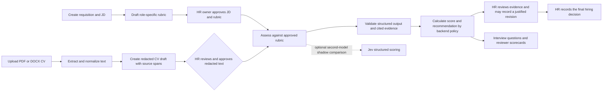

# TalentScreen AI

**Evidence-grounded CV review for technical hiring, with HR in control.**

TalentScreen AI is a portfolio MVP that helps an HR team organize applications, compare a CV with an approved job description and rubric, inspect the evidence behind model output, and prepare a structured interview. It is designed to assist reviewers—not to make or communicate hiring decisions.

> **Status: sandbox / portfolio prototype.** The workflow and software tests are implemented, but representative hiring data, independent HR/IT evaluation, model-quality and fairness validation, and production operations have not been signed off. Do not use its scores to make decisions about real applicants.


<p align="center"><sub>The redesigned HR workspace uses fictional synthetic recruitment data in this screenshot; it does not show real applicants.</sub></p>

## Why this project

Manual CV screening can be slow and inconsistent. This project explores a more reviewable workflow: define job-related criteria first, show the source text behind each AI observation, keep missing evidence distinct from a low score, and require a human reviewer to make the final decision.

## HR workflow



## What is implemented

- **Requisitions and job criteria:** create and manage hiring rounds, version job descriptions, and draft rubrics with 2–12 job-related criteria, weighted to 100%, with explicit 0–4 scoring anchors. A rubric must be aligned to the current JD and approved by an authorized HR owner before assessment.
- **CV intake:** upload PDF or DOCX files individually or in batches. Current defaults are 20 files per batch, 10 MB per file, and a 10-page processing limit. DOCX page validation requires LibreOffice; scanned PDFs can use a local Tesseract OCR fallback.
- **Redacted review:** inspect the sanitized text and approve it before an external assessment can run. Access to the original CV is role-gated, time-limited, and audited. Pattern-based redaction is a safeguard that still requires human review; it is not a guarantee that every identifier is removed.
- **Evidence-based assessment:** evaluate each approved rubric criterion, cite exact source spans from the reviewed CV, and flag missing or conflicting evidence. Missing evidence remains unscored rather than being treated as zero. Backend code validates the response and calculates weighted scores and advisory recommendations.
- **Human review and decisions:** HR can review the evidence, record a justified score revision, compare candidates in a requisition matrix, and record the final outcome. The AI output is advisory; the app does not automatically advance or reject an applicant.
- **Interview support:** create role question banks, generate candidate-specific follow-up questions from evidence gaps, and record interviewer scorecards separately from the AI CV assessment.
- **Operations:** inspect retention and deletion-request workflows, job status, provider usage, and operational readiness. The HR workspace focuses on recruitment queues, applications, evidence, and decisions; legacy `/sandbox` bookmarks redirect to the dashboard.

## AI providers and retrieval

- **Mock provider is the default.** Local development and `make test` do not require a model API key and do not make live LLM calls.
- **DeepSeek** is available through the backend provider adapter when explicitly configured. Keep credentials in the untracked root `.env` file; never commit keys or applicant data.
- **Jev 1.13** is implemented as an optional structured secondary scorer in shadow mode. It is off by default and requires separate data-processing approval, a key, and a verified rate card. Jev output is for comparison and does not determine the HR outcome.
- **Retrieval and agent:** the opt-in `hybrid` path uses local `intfloat/multilingual-e5-base` embeddings at a pinned model revision, section-aware token chunks, lexical + vector ranking with reciprocal-rank fusion, and source-span citations. A LangGraph agent can make up to two bounded read-only evidence retrieval calls; it cannot choose an applicant/requisition scope or write a decision. Default `RAG_MODE=full_text_baseline` keeps hybrid retrieval off until explicitly enabled.
- **Validation boundary:** E5, hybrid retrieval, and agent behavior have automated mock/synthetic regression coverage. The committed role-specific fixture is invented smoke data, not an HR/IT-labeled holdout; semantic retrieval quality, human agreement, fairness, latency under hiring load, and live-provider behavior are still unvalidated. No synthetic “pass” authorizes real hiring decisions.

## Design and technology

| Layer | Implementation |
| --- | --- |
| Web app | Next.js 15 App Router, React 19, TypeScript, responsive CSS |
| API | FastAPI, Python 3.12, Pydantic v2 |
| Persistence | PostgreSQL 16, SQLAlchemy async, Alembic migrations, pgvector extension |
| Background work | Database-backed job queue and a separate CV/AI worker |
| Document processing | PDF/DOCX text extraction, PDF OCR fallback, source-span tracking |
| Retrieval / agent | Local multilingual E5, PostgreSQL full-text + pgvector RRF, section-aware provenance, bounded LangGraph read-only tools |
| Model adapters | Mock and DeepSeek primary provider; optional Jev 1.13 structured shadow provider |
| Local services | Docker Compose for PostgreSQL; frontend served on port 2004 |

### Evidence and decision flow

Model output is treated as untrusted structured data. The backend checks that criterion IDs match the approved rubric and that cited quotes match registered source spans. Hybrid retrieval is criterion-scoped; the agent's tools are read-only, bounded, and restricted to the assessment snapshot. The score and recommendation are calculated from the approved weights and thresholds; the model does not choose the hiring outcome. HR must review the evidence and record the decision.

The rubric policy rejects a set of explicitly disallowed demographic and proxy criteria. This is a technical guardrail, not proof that the system is free of bias. Fairness still requires representative data, independent human evaluation, and ongoing monitoring.

## Run locally

### Prerequisites

- macOS, Linux, or another environment able to run the Python and Node toolchains
- Python 3.12 and [uv](https://docs.astral.sh/uv/)
- Node.js 20+ and npm
- Docker Desktop or Docker Engine
- LibreOffice for DOCX processing; Tesseract for OCR of scanned PDFs

### Setup

Clone the repository, then run these commands from its root:

```bash
git clone https://github.com/DucPh4t/TalentScreen-AI.git
cd TalentScreen-AI
cp .env.example .env
make bootstrap
make doctor
make db-up
.venv/bin/alembic upgrade head
```

Use the sandbox defaults in `.env` for local development. Replace the development signing key with a locally generated value, and keep `.env` out of Git.

Create the first local administrator after applying the migrations. This prompts for the password without putting it in shell history:

```bash
PYTHONPATH=services/backend .venv/bin/python - <<'PY'
import asyncio
import getpass
from app.cli import create_admin

asyncio.run(create_admin(
    login="local-admin",
    password=getpass.getpass("Choose an admin password: "),
    display_name="Local Administrator",
))
PY
```

Start each process in a separate terminal from the repository root:

```bash
make dev-backend
make dev-web
make dev-worker
```

Open **http://localhost:2004**. The FastAPI sandbox documentation is at **http://127.0.0.1:8000/docs**. If port 8000 is already in use, start the backend and web app with the same override, for example `make dev-backend BACKEND_PORT=8001` and `make dev-web BACKEND_PORT=8001`.

### Tests

```bash
make test
```

The test target starts a disposable PostgreSQL/pgvector database, applies migrations, runs the backend test suite, and builds the web app. It uses the mock provider; it does not validate live model quality, fairness, or hiring outcomes.

## Repository map

```text
apps/web/                    Next.js HR workspace
services/backend/app/api/    FastAPI endpoints
services/backend/app/services/
                             CV intake, sanitization, assessment, decisions,
                             interview, retrieval, providers, and operations
services/backend/alembic/    Database migrations
services/backend/tests/      Backend regression and workflow tests
docs/reviews/                Dated implementation and readiness reviews
talentscreen-mvp-plan/       Product and implementation plan
```

## Known limitations

- This is not approved for public deployment or AI-assisted decisions in a live hiring round. The repository does not contain validated agreement results against independent HR/IT labels or a representative, locked holdout set.
- A passing mock test suite proves software contracts and workflow behavior, not that a model scores candidates accurately or fairly.
- `RAG_MODE` defaults to `full_text_baseline`; the hybrid E5 path requires downloading/loading local model weights and has not passed a representative HR/IT retrieval benchmark. Its presence in code is not a quality claim.
- The redaction rules can miss identifiers. Human review is mandatory before an external provider receives sanitized text.
- The deletion and retention UI/API workflows exist, but backup-restore deletion replay and production purge operations still need an independently verified drill.
- Production ingress controls, sustained-load/SLO evidence, alerting, and live-provider failure testing remain outstanding. ATS integration, candidate email, interview scheduling, and dossier export are not implemented.

For the product and implementation specification, see the [MVP plan](talentscreen-mvp-plan/README.md).

---

### Tóm tắt tiếng Việt

TalentScreen AI là MVP hỗ trợ HR rà soát CV IT theo JD và rubric đã duyệt. Hệ thống trích dẫn bằng chứng, đánh dấu thông tin còn thiếu, hỗ trợ chuẩn bị phỏng vấn; HR kiểm tra và quyết định cuối cùng. Đây là bản sandbox/portfolio, chưa được xác nhận chất lượng hoặc fairness để dùng điểm AI cho hồ sơ tuyển dụng thật.
