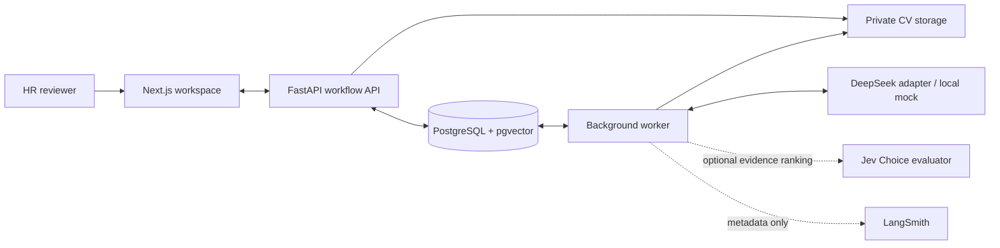
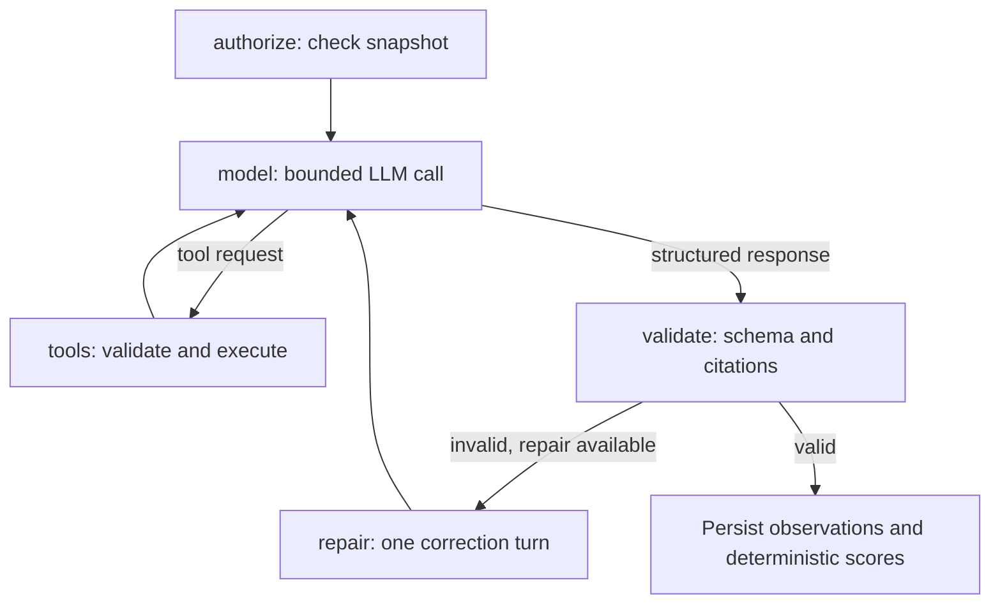

# TalentScreen AI

**Evidence-based CV screening with hybrid RAG, a bounded LangGraph agent, and optional Jev reranking.**

[](https://github.com/DucPh4t/TalentScreen-AI/actions/workflows/ci.yml)

[](services/backend/pyproject.toml)
[](services/backend/app/main.py)
[](apps/web/package.json)
[](apps/web/package.json)
[](docker-compose.yml)
[](docker-compose.yml)

[](#rag-and-agent-workflow)
[](services/backend/app/services/agent/assessment_graph.py)
[](services/backend/app/services/llm)
[](#jev-evidence-reranking)
[](docs/runbooks/langsmith-observability.md)

TalentScreen AI turns a job description and candidate CV into a criterion-by-criterion assessment with traceable evidence. Built for a university HR use case, it combines CV review, application comparison, structured interviews, and auditable human decisions. Users define their own JD and rubric for each vacancy.

**Status:** local MVP with regression and synthetic benchmark evidence. HR owns hiring decisions. Hybrid RAG V2 is opt-in; Jev reranking is implemented and live-tested, but remains **off by default** pending quality validation.

[Engineering](#engineering-highlights) · [Architecture](#architecture) · [RAG & agent](#rag-and-agent-workflow) · [Jev](#jev-evidence-reranking) · [Results](#evaluation-results) · [Quickstart](#quickstart) · [Code guide](#code-guide)


*Vietnamese HR workspace with responsive candidate review. Screenshot uses synthetic records, captured on 8 October 2026.*

## Engineering highlights

| Capability | Implementation | Why it matters |
|---|---|---|
| **Versioned hybrid RAG** | Local multilingual E5, pgvector cosine search, PostgreSQL lexical search, RRF, and separate V1/V2 indexes | Retrieves evidence for each approved criterion within the current CV snapshot. |
| **Optional evidence reranking** | Jev Choice judgments over scoped criterion–passage pairs, protected evidence selection, private journal | Separates passage relevance from applicant scoring; default off and gated by measured results. |
| **Bounded tool-calling agent** | Five-node LangGraph workflow, two read-only tools, explicit model/tool/repair limits | Searches for additional evidence without accessing other candidates or taking hiring actions. |
| **Grounded structured output** | Pydantic contracts, exact span/quote validation, criterion-scoped citations | Rejects references outside the supplied evidence; missing or conflicting evidence stays `null`. |
| **Reliable execution and cost control** | Background jobs, frozen input versions, reserve-before-call ledger, full serialized request fitting | Rejects stale results and limits outbound calls, context size, and spend. |
| **Reproducible evaluation** | Actual-service ablations, frozen synthetic inputs, invocation journals, offline metrics | Separates retrieval availability, model quality, integration reliability, and cost uncertainty. |

Latest recorded verification, **9 October 2026**: [508 backend tests passed, one opt-in test skipped; 23 frontend tests and production build passed](docs/reviews/2026-10-09-repository-cleanup.md); [480/480 E5 + mock benchmark runs accepted](docs/evaluation/rag-packing-results-2026-10-09.md). These measure software behavior and retrieval, not real hiring accuracy.

## Product workflow

1. **Define the vacancy.** Enter a JD; generate or edit 2–12 weighted criteria with 0–4 anchors; approve the rubric and open applications. Sending the JD to a model for rubric drafting requires explicit egress approval.
2. **Review CVs.** Upload PDF/DOCX individually or in batches. Inspect the extracted/OCR and redacted text, then approve it before external assessment.
3. **Assess evidence.** Eligible approvals queue jobs. Review criterion observations, citations, gaps, coverage, and advisory recommendations.
4. **Screen applications.** Compare evidence and choose invite, request information, or do not continue—with a reason and versioned history.
5. **Conduct interviews.** Plan rounds, assign interviewers, edit cited questions, submit independent scorecards, and record a human conclusion.
6. **Prepare follow-up.** Edit and approve correspondence templates; manage retention and deletion requests.

The Vietnamese UI supports desktop, tablet, and phone layouts; CVs may be Vietnamese, English, or mixed-language. Original CV access is role-gated and audited. Anonymized labels, duplicate hints, and review-SLA alerts support the queue without changing capability scores.

<details>
<summary><strong>View the mobile workspace</strong></summary>


[UI verification](docs/reviews/2026-10-08-candidate-list-ux.md) · [Screening and interview workflow](docs/hr-workflow.md)

</details>

## Architecture



The backend is a **modular monolith with a separate worker process**. PostgreSQL holds workflow state, versions, vectors, audits, and invocation budgets. Slow extraction and AI work run outside HTTP requests. Search is scoped to one approved CV/configuration. The transient LangGraph has no checkpointer; PostgreSQL stores durable job/run state.

| Layer | Technology |
|---|---|
| HR workspace | Next.js 15, React 19, TypeScript, responsive CSS, PDF.js |
| API and validation | FastAPI, Python 3.12, Pydantic v2 |
| Persistence | PostgreSQL 16, pgvector, async SQLAlchemy 2, Alembic |
| Retrieval | Sentence Transformers, multilingual E5, lexical search, RRF |
| Agent and inference | LangGraph, DeepSeek HTTP adapter, explicit local mock |
| Optional passage evaluator | Jev 1.13 Choice API via OpenRouter; separate from primary scoring |
| Developer observability | Optional LangSmith spans with a metadata allowlist |
| Documents and tooling | PDF/DOCX extraction, Tesseract, LibreOffice, Docker, pytest, GitHub Actions |

[Architecture walkthrough](docs/architecture.md) · [Current retrieval versions and packing rules](docs/evaluation/rag-pipeline-versions.md)

## RAG and agent workflow

**Hybrid means combining semantic and keyword retrieval.** It does not mean combining DeepSeek and Jev. The approved rubric supplies the search criteria; the approved, redacted CV supplies the evidence.

| Component | Role in this application |
|---|---|
| **Dense search** | Multilingual E5 embeddings + pgvector cosine similarity retrieve passages by meaning, including Vietnamese/English phrasing. |
| **Lexical search** | PostgreSQL full-text search with `simple` tokenization and `ts_rank_cd` retrieves matching technical vocabulary. This is not a BM25 implementation. |
| **Rank fusion** | Reciprocal Rank Fusion (`k=60`) combines the two ranked lists without mixing incompatible raw scores. |
| **Optional Jev** | Classifies criterion–passage relevance before evidence selection; does not score the applicant. |
| **DeepSeek + LangGraph** | Produces cited observations and can request more scoped evidence through bounded tools. |
| **Backend + HR** | Validates citations, calculates deterministic scores, and records the human decision. |

For a SQL criterion, keyword retrieval can find `PostgreSQL`, while dense retrieval can find a differently worded account of query optimization. RRF merges these results; DeepSeek still needs cited evidence to support an observation. Retrieval matches alone do not prove competence.

### 1. Retrieve evidence against the approved rubric

The approved rubric's labels, descriptions, anchors, and bilingual terms drive retrieval over the approved, redacted CV.

1. Preserve canonical source spans for immutable citation targets.
2. Build a versioned index. **V1** groups adjacent section-local spans; **V2** indexes individual spans and deduplicates exact repeated text within a section. Both split oversized spans losslessly at 480 tokens.
3. Encode passages/queries with pinned `intfloat/multilingual-e5-base`, using `passage: ` / `query: ` prefixes and normalized **768-dimensional vectors**. CPU, Apple MPS, and CUDA are supported.
4. Fuse dense and lexical ranks using **RRF, k=60**. V2 prioritizes approved bilingual skill terms in an 800-character query and retrieves up to 30 candidates per channel; V1 retains its legacy query and ten-candidate pool.
5. Optionally evaluate criterion–passage pairs with **Jev**, before selecting up to four chunks per criterion. Off keeps RRF; shadow observes; rerank changes selection; hard gating is restricted to internal synthetic experiments. [Limits and rollback](docs/runbooks/jev-reranking.md).
6. Select up to four section-diverse chunks per criterion, resolve canonical spans, and fit the complete model request. Each turn is bounded to **65,536 UTF-8 bytes** and **24,000 unique evidence characters**. Eviction removes whole spans and updates citation scope; quotes are never shortened.

Versioned indexes coexist. New runs pin their retrieval/embedding configuration and packing version; older snapshots retain V1 retrieval. Hybrid failures produce an explicit failed/manual-review path, without silently switching to full-text or another provider.

### 2. Use tools only when additional evidence is needed



| Tool | Allowed operation | Boundary |
|---|---|---|
| `retrieve_more_evidence` | Search for evidence using a validated technical query hint | Current approved CV; at most four approved criterion IDs per request. |
| `get_source_spans` | Read exact text for retrieved evidence | At most eight span IDs exposed by the preceding retrieval, within the same snapshot. |

The graph permits **two tool executions, three normal model turns, and one repair**. With reranking off, the default assessment ceiling is four primary calls. Enabled reranking freezes separate limits of **four primary, nine Jev, and thirteen total calls**, including admitted/failed calls. Scope/limit violations stop execution. Tools cannot browse externally, write decisions, or send messages. Optional LangSmith traces export metadata, not CVs, prompts, model responses, or query text.

### 3. Validate observations before calculating scores

The backend validates structured observations and exact citations before Decimal-based scoring. **Observed score**, **coverage**, and **comparable score** stay separate; comparability requires complete assessment without missing/conflicting criteria. Valid citations do not prove correct interpretation—HR reviews the evidence and reasoning.

## Jev evidence reranking

**Jev 1.13 evaluates passages; DeepSeek evaluates cited observations; HR decides.** Jev sits inside initial retrieval and agent retrieval tools, rather than adding another LangGraph node. The implementation uses the OpenRouter Choice endpoint and validates the served model against a frozen allowlist.

**Which score?** Jev returns passage-category probabilities. The backend derives a relevance utility to rank evidence, not an applicant's 0–4 criterion score or overall fit score. Enabled reranking can indirectly change the primary assessment by changing the evidence shown to DeepSeek; Jev does not replace that assessment or the deterministic scoring rules.

**Does it save money?** Cost reduction is a hypothesis, not a verified result here. Reranking adds Jev calls and latency; both baseline and rerank select up to four chunks per criterion. A different evidence pack may affect primary token use, but lower total cost must be demonstrated in a controlled comparison that includes both providers. Current experiments do not establish net savings.

Each approved criterion–passage pair receives one of five categories: `substantive_evidence`, `mention_only`, `limiting_evidence`, `unrelated`, or `unclear`. Selection protects a limiting passage and an unscored passage when available, but these protections do not guarantee complete negative/conflicting evidence retention.

| Mode | Effect on the evidence pack | Current use |
|---|---|---|
| `off` | Baseline RRF selection; no Jev calls | Recommended default |
| `shadow` | Record judgments while retaining baseline selection | Controlled observation |
| `rerank` | Change passage order and selection | Opt-in, pending activation evidence |
| `gate_experiment` | Also omit highly confident unrelated passages | Internal synthetic sandbox only |

Calls have bounded batch/request sizes, reserve-before-call accounting, and a private run-scoped journal. Ambiguous provider outcomes retain their reservation and cannot be replayed automatically. HR sees an evidence-review notice when applicable; developer metadata goes to optional LangSmith traces.

**Live evidence, 9 October 2026:** Jev actually served `typesafe/jev-1.13-20260917`. The synthetic suite accepted 21/22 assessments plus a contract probe. Eighteen assessments used **real Jev with a mock primary**; the live DeepSeek comparison covered only one Node.js case. These acceptance counts measure execution, not scoring accuracy.

Reranking delivered more annotated evidence overall, but lost some negative evidence available in the matching shadow baseline. One invocation has an unresolved outcome. An off/enabled query mismatch was fixed after the experiment; the corrected code has not had a paid rerun. **Activation gates are not met, so Jev stays off.**

[Measured results and provenance](docs/evaluation/jev-reranking-results-2026-10-09.md) · [Configuration, limits, and rollback](docs/runbooks/jev-reranking.md) · [Regression verification](docs/reviews/2026-10-09-jev-reranking-verification.md)

## Evaluation results

A controlled comparison used **60 frozen synthetic stress CVs** across Node.js, AI/ML, and Android in Vietnamese, English, and mixed-language formats. V1/V2 shared code, inputs, rubric, prompt/schema, E5 revision, seed, and request bound.

| Profile | V1 sufficient-group coverage | V2 sufficient-group coverage | V2 Span Recall@10 |
|---|---:|---:|---:|
| Full-text baseline | 108/222 · 48.6% | 108/222 · 48.6% | Not applicable |
| Dense retrieval | 30/222 · 13.5% | 193/222 · 86.9% | 99.8% |
| Hybrid RAG | 45/222 · 20.3% | **210/222 · 94.6%** | **100.0%** |
| Hybrid + bounded agent | 45/222 · 20.3% | 210/222 · 94.6% | 100.0% |

**Measured:** actual E5/pgvector and the assessment service completed **480/480 mock-LLM runs**. Coverage requires all spans of an annotated sufficient evidence group to reach the model. On the public slice, hybrid V2 covered 86/87 groups (98.9%) after code freeze.

The evaluator also supports numeric MAE, weighted kappa, status agreement, and counterfactual comparisons for live-model experiments; mock quality metrics remain unmeasured.

**Limits:** coverage is not scoring accuracy. Mock made zero tool calls; agent recovery remains unmeasured. Visible synthetic references are not protected holdout or independent HR/IT labels. Real hiring quality, fairness, and production SLOs are not established.

An earlier **12-run live DeepSeek probe** verified integration on three synthetic cases (USD 0.023525 peak-rate estimate). It used the earlier retrieval setup; it does not validate live V2 quality.

[Controlled results and provenance](docs/evaluation/rag-packing-results-2026-10-09.md) · [Earlier live probe](docs/evaluation/ai-benchmark-results-2026-10-09.md) · [Reproduction protocol](docs/evaluation/ai-benchmark-reproducibility.md)

Read the evidence at the appropriate level:

| Evidence | Establishes | Still unmeasured |
|---|---|---|
| Regression tests and build | Tested contracts, workflow behavior, migration compatibility, and compilation | Production reliability and hiring quality |
| E5 + mock ablations | Evidence retrieval/packing on frozen synthetic references | Live interpretation and scoring accuracy |
| Live DeepSeek/Jev probes | Provider integration and observed sample behavior | General model benefit, live tool recovery, independent HR agreement |

[Jev experiment](#jev-evidence-reranking) · [AI Engineering README review and related projects](docs/reviews/2026-10-09-readme-ai-engineering-review.md)

## Quickstart

Run commands from the repository root. Requirements: **Python 3.12**, **uv**, **Node.js 20+**, npm, and Docker with Compose v2. Install LibreOffice for DOCX page validation and Tesseract with English/Vietnamese language data for scanned CVs.

### 1. Install and initialize

```bash
git clone https://github.com/DucPh4t/TalentScreen-AI.git
cd TalentScreen-AI
cp .env.example .env
make bootstrap
```

Generate a signing key with `openssl rand -hex 32` and set `SECRET_KEY` in `.env`. The first run can use the default `LLM_PROVIDER=mock`, with no external LLM calls. Credentials and candidate files remain outside Git.

```bash
make doctor
docker compose up -d --wait postgres
.venv/bin/alembic upgrade head
```

### 2. Create a local account

Choose a password interactively; this snippet creates or updates `local-admin` without putting the password in shell history.

```bash
PYTHONPATH=services/backend .venv/bin/python - <<'PY'
import asyncio
import getpass
from app.cli import create_admin

asyncio.run(create_admin(
    login="local-admin",
    password=getpass.getpass("Admin password: "),
    display_name="Local Administrator",
))
PY
```

### 3. Start API, worker, and frontend

Use one terminal for each command:

```bash
make dev-backend
make dev-worker
make dev-web
```

Open [localhost:2004](http://localhost:2004) and sign in as `local-admin`. API docs: [127.0.0.1:8000/docs](http://127.0.0.1:8000/docs). If port 8000 is occupied, pass the same `BACKEND_PORT=8001` to both `make dev-backend` and `make dev-web`.

Keep the worker running for extraction/assessments. Follow the [HR workflow](docs/hr-workflow.md) to create a vacancy and try a synthetic CV.

### 4. Enable RAG V2 and a live provider

| Setting | Repository default | Optional configuration |
|---|---|---|
| `LLM_PROVIDER` | `mock` | Set `deepseek`, configure `DEEPSEEK_API_KEY`, `DEEPSEEK_MODEL`, and provider/budget settings. |
| `RAG_MODE` | `full_text_baseline` | Set `hybrid` for E5 + lexical/vector retrieval. |
| `RAG_PIPELINE_VERSION` | `v1` | Set `v2` for the improved span index and bilingual query; `v1` rolls back new runs. |
| `EMBEDDING_DEVICE` | `auto` | Explicit `cpu`, `mps`, or `cuda` when needed. |
| `LANGSMITH_TRACING` | `false` | Enable developer metadata traces after configuring your own key/project. |
| `JEV_RERANK_MODE` | `off` | Keep off for normal use; see the [Jev runbook](docs/runbooks/jev-reranking.md) for controlled experiments. |

Restart **API and worker** after changing settings. Hybrid first use may download pinned E5 weights; offline benchmarks require a populated cache. Provider configuration alone does not verify live inference.

Jev reranking uses a separate `JEV_API_KEY`, processor approval, a current verified rate card, and an accepted-model allowlist. For the measured Choice route, override `JEV_BASE_URL` with `https://openrouter.ai/api/alpha/decisions`; the template retains the older System One endpoint for compatibility. Do not copy expired rate dates from a report. The legacy `JEV_MODE` secondary scoring shadow is a different integration and cannot run together with reranking; keep `JEV_MODE=off` for this path. [Full configuration](.env.example).

## Verification and benchmark commands

```bash
# Disposable PostgreSQL/pgvector DB, backend tests, frontend tests and build.
make test

# Actual-service contract smoke: no paid calls, scripted embedding test double.
bash scripts/run_ai_benchmark_isolated.sh run \
  --dataset fixtures/ai_benchmark/v1 --provider mock --profiles all \
  --cases node-01,ai-01,android-01 --embedding-mode scripted \
  --output reports/ai-benchmark/new-smoke --max-cost-usd 5

# Real cached E5, frozen stress data, mock LLM; start with development.
bash scripts/run_ai_benchmark_isolated.sh run \
  --dataset fixtures/ai_benchmark/v2 --provider mock --profiles all \
  --split development --embedding-mode real --retrieval-version v2 \
  --output reports/ai-benchmark/new-rag-v2 --max-cost-usd 5
```

Each experiment needs a new output directory. See [prerequisites, tokenizer proof, journals, and reporting](docs/evaluation/ai-benchmark-reproducibility.md). CI tests backend/frontend and builds Next.js with external providers/tracing disabled; real E5 measurement runs separately.

## Code guide

| Start here | Review focus |
|---|---|
| [Embedding/indexing](services/backend/app/services/embedding.py) → [retrieval](services/backend/app/services/retrieval.py) | Immutable span targets, index versioning, document filters, query construction, RRF. |
| [LangGraph](services/backend/app/services/agent/assessment_graph.py) → [tools](services/backend/app/services/agent/tools.py) | Authorization, bounded tool calls, stale inputs, validation and repair. |
| [Request fitter](services/backend/app/services/agent/request_budget.py) → [invocation ledger](services/backend/app/services/llm/ledger.py) | Complete UTF-8 request accounting, whole-span eviction, budget reservation and settlement. |
| [Prompts](services/backend/app/services/assessment/prompt.py) → [validator](services/backend/app/services/assessment/validator.py) → [scoring](services/backend/app/services/assessment/scoring.py) | Versioned prompts, exact citations, deterministic scoring and abstention. |
| [Jev reranking](services/backend/app/services/reranking) → [reranking evaluation](services/backend/app/services/evaluation/benchmark/reranking.py) | Pair contracts, protected selection, resumable journals, provider-aware budgets, and activation gates. |
| [Benchmark runner/evaluator](services/backend/app/services/evaluation/benchmark) | Controlled profiles, label separation, owned isolation, metrics and financial reconciliation. |

```text
apps/web/                     Next.js HR workspace
services/backend/app/
  api/v1/                     Workflow and authentication endpoints
  services/agent/             LangGraph and scoped evidence tools
  services/assessment/        Prompts, validation, scoring and snapshots
  services/llm/               Provider adapters and invocation ledger
  services/reranking/         Optional Jev passage judgments and selection
  services/evaluation/        Metrics and actual-service benchmark
services/backend/alembic/      Database migrations
services/backend/tests/        Regression and integration tests
scripts/                      Local tooling and benchmark entry points
fixtures/                     Synthetic seeds and evaluation data
docs/                         Architecture, results, workflow and runbooks
```

## Scope and next validation

Next: bounded live V2/tool-recovery evaluation, independent HR/IT labels, and operational verification. Email delivery, ATS/calendar integrations, and dossier export remain future work. Interview conclusions do not create offers. Public deployment and real-data use require the [G1–G7 readiness gates](docs/runbooks/rag-agent-readiness.md).

[Detailed workflow](docs/hr-workflow.md) · [Latest verification](docs/reviews/2026-10-09-jev-reranking-verification.md) · [LangSmith setup](docs/runbooks/langsmith-observability.md) · [Full configuration](.env.example)

<details>
<summary>Giới thiệu tiếng Việt</summary>

TalentScreen AI hỗ trợ HR đối chiếu CV với JD và rubric đã duyệt. Hybrid RAG kết hợp tìm theo ý nghĩa (E5 + pgvector) và từ khóa (PostgreSQL), gộp thứ hạng bằng RRF. Jev tùy chọn đánh giá độ liên quan của đoạn CV, DeepSeek tạo nhận xét có trích dẫn; agent chỉ đọc dữ liệu trong hồ sơ hiện tại. Điểm AI mang tính tham khảo, thiếu/mâu thuẫn bằng chứng giữ điểm trống, HR quyết định cuối cùng. Dự án có kiểm thử và benchmark; chất lượng tuyển dụng thật cần đánh giá độc lập.

</details>
