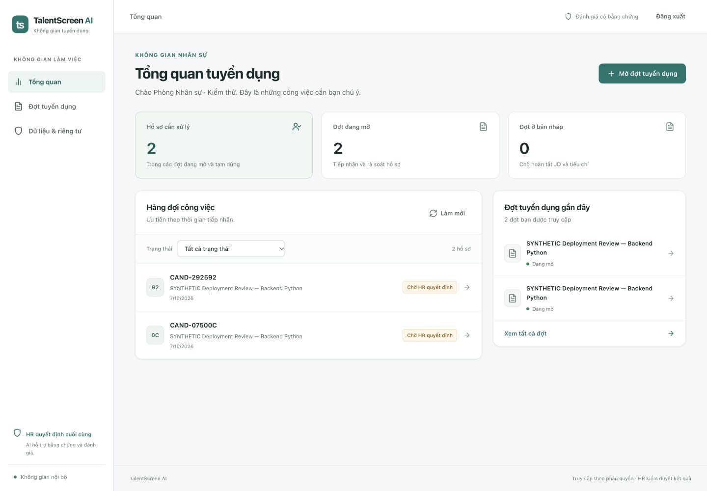
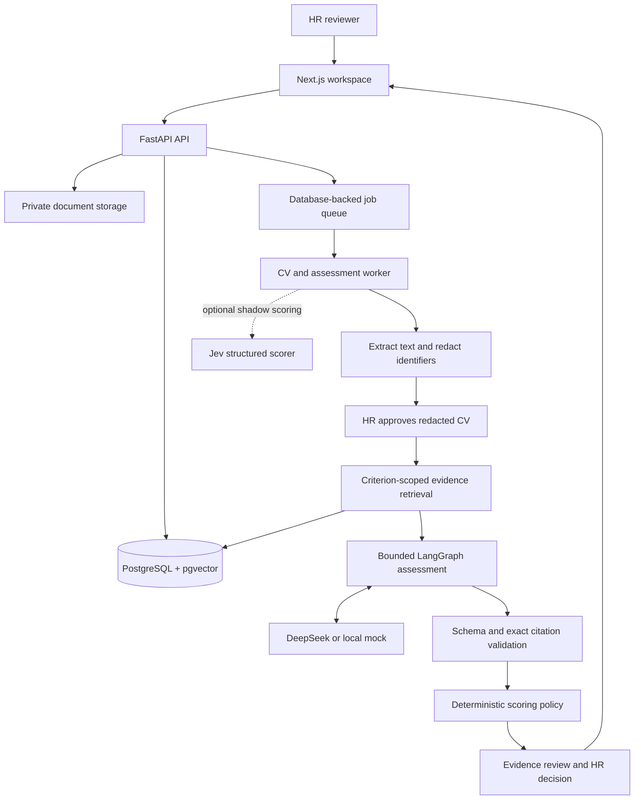
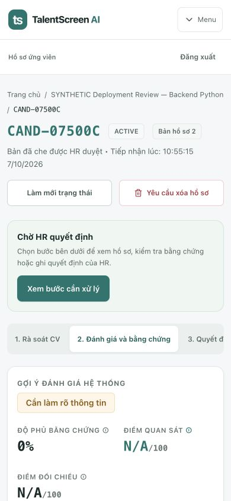

# TalentScreen AI

**Evidence-grounded CV assessment with hybrid RAG, bounded AI agents, and human review.**

[](https://github.com/DucPh4t/TalentScreen-AI/actions/workflows/ci.yml)

TalentScreen AI helps an HR team review applications against a versioned job description and role-specific scoring rubric. It retrieves relevant CV evidence, validates model citations, surfaces information gaps, and supports structured interviews. HR reviews the evidence and records the final decision.

The project implements a complete local workflow across **Next.js, FastAPI, PostgreSQL/pgvector, multilingual E5, and LangGraph**, with DeepSeek as the configurable primary model and Jev as an optional secondary scorer.

**Status:** local MVP with automated regression coverage. Hybrid retrieval is opt-in; real hiring quality and production operations still require independent validation. See [validation status](#evaluation-and-validation-status).

[Architecture](#architecture) · [RAG & agent](#rag-and-agent-design) · [Features](#product-workflow) · [Run locally](#run-locally) · [Tests](#evaluation-and-validation-status) · [Code walkthrough](#code-walkthrough)



*Recruitment dashboard with a review queue and recent requisitions. Screenshots use fictional synthetic records.*

## The problem

A useful recruitment assistant needs more than a similarity score. Reviewers need to know which job requirement was assessed, where the supporting evidence came from, what remains unknown, and whether a result is still valid after a CV or rubric changes.

TalentScreen AI makes those requirements explicit: each assessment records the approved CV/rubric versions, prompt versions, and selected retrieval strategy. Missing evidence remains `null`; a model response cannot directly advance or reject an applicant.

## Engineering highlights

| Area | Implementation | Purpose |
| --- | --- | --- |
| Hybrid RAG | Section-aware chunks, local multilingual E5 embeddings, PostgreSQL lexical search + pgvector, reciprocal-rank fusion | Retrieve evidence for each approved rubric criterion. |
| Bounded agent | LangGraph state machine with two allowlisted read-only tools, explicit call limits, and snapshot checks | Find additional evidence within the authorized record. |
| Grounding | Pydantic schemas, exact span/quote validation, criterion-scoped citations | Reject malformed output and references outside the supplied evidence. |
| Scoring policy | Deterministic Decimal arithmetic, approved weights and anchors, separate evidence coverage | Keep model observations distinct from application scoring policy. |
| Reliability & cost | Background jobs, budget reservation/settlement, per-requisition cap, bounded repair | Limit spend and keep failure states visible. |
| Evaluation | Criterion-scoped retrieval metrics, agreement metrics, counterfactual checks, role/provider reports | Measure retrieval, scoring, and operational behavior separately. |

## Architecture



The backend is a **modular monolith** with a separate worker process. PostgreSQL stores workflow state, document provenance, vectors, invocation ledgers, and audit events. This keeps local setup manageable while separating slow document/model work from HTTP requests.

Read the [architecture walkthrough](docs/architecture.md) for data boundaries, state transitions, and implementation trade-offs.

## RAG and agent design

### Retrieval pipeline

1. Extract and normalize the PDF/DOCX. Create a redacted document version and canonical source spans; HR approves that version before external assessment.
2. Group adjacent spans within a section into chunks targeting **300 tokens**, with a **480-token maximum**. Oversized spans are split without changing the canonical citation target.
3. Encode passages and rubric queries with pinned `intfloat/multilingual-e5-base`: **768-dimensional normalized vectors**, with E5's `passage: ` and `query: ` prefixes. Local device selection supports CPU, Apple MPS, or CUDA when available.
4. Search only the current approved redacted version. Retrieve up to 10 dense and 10 lexical candidates, fuse ranks with **RRF (`k=60`)**, deduplicate, and select up to four section-diverse chunks per criterion within the evidence budget.
5. Resolve selected chunks back to canonical spans. The model may cite only spans supplied for the relevant criterion; the backend checks the complete quote against registered source text.

`RAG_MODE=full_text_baseline` is the default. `RAG_MODE=hybrid` enables E5 + lexical/vector retrieval. A hybrid retrieval failure produces an explicit failed/manual-review path; it does not silently expand context or switch providers.

### Bounded evidence agent

The assessment graph authorizes the input snapshot, calls the model, validates tool requests, and validates the final structured response. It may perform **two tool executions**, **three normal model turns**, and **one validation repair**, subject to the assessment-wide outbound-call ceiling (default: four).

| Tool | Capability | Server-enforced boundary |
| --- | --- | --- |
| `retrieve_more_evidence` | Search for evidence for selected rubric criteria | Current approved CV snapshot; at most four approved criterion IDs per request; validated technical query hint. |
| `get_source_spans` | Read exact canonical text for retrieved spans | At most eight span IDs exposed by the preceding retrieval, within the same snapshot. |

Tools cannot browse the web, send messages, modify records, or record a hiring decision. The graph is transient: durable job/run status lives in PostgreSQL rather than a separate LangGraph checkpoint service. The UI exposes a compact execution trace and lets HR request additional evidence for a selected criterion.

### Model and scoring boundaries

- **Mock:** default for local development and regression tests; no live LLM requests.
- **DeepSeek:** configurable primary provider with structured responses and validated tool calls. API credentials stay in the untracked `.env` file.
- **Jev 1.13:** optional structured secondary scorer in **shadow mode**, off by default. It requires separate configuration, processing approval, and a verified rate card. Its output stays separate from the primary assessment and the human decision.
- **Backend policy:** computes observed score, evidence coverage, comparable score, and advisory recommendation. Incomplete/conflicting evidence is unscored; a comparable score is available only when all rubric criteria are assessed without conflicts.

## Product workflow

| Step | HR capability |
| --- | --- |
| Define a vacancy | Create a requisition, version the JD, draft/approve a dynamic rubric with 2–12 criteria, weights, and 0–4 anchors. |
| Receive applications | Upload PDF/DOCX files individually or in batches; monitor extraction and OCR status. |
| Review privacy | Inspect and approve redacted text. Original-document access is role-gated, time-limited, and audited. |
| Assess evidence | Inspect per-criterion observations, source citations, information gaps, coverage, and provider status. |
| Compare and decide | Compare applications, record justified revisions, and submit the final human decision after required review. |
| Prepare interviews | Generate candidate-specific follow-ups and record interviewer scorecards separately from CV assessment. |
| Manage data | Track retention settings and deletion requests through their processing states. |

The Vietnamese interface supports desktop, tablet, and phone layouts. Navigation focuses on **Overview / Requisitions / Data & privacy**. Technical execution details are collapsed by default; the old training page redirects to the dashboard.

<details>
<summary>Mobile candidate workspace</summary>
<br />

</details>

## Technology stack

| Layer | Technology |
| --- | --- |
| Frontend | Next.js 15 App Router, React 19, TypeScript, responsive CSS, PDF.js viewer |
| API & validation | FastAPI, Python 3.12, Pydantic v2 |
| Database | PostgreSQL 16, pgvector, SQLAlchemy 2 async, Alembic |
| Retrieval | Sentence Transformers, multilingual E5, PostgreSQL full-text search, RRF |
| Agent & providers | LangGraph, DeepSeek adapter, optional Jev shadow adapter |
| Documents & operations | PDF/DOCX extraction, Tesseract OCR, LibreOffice, Docker Compose, pytest, GitHub Actions |

## Run locally

### Prerequisites

Python **3.12**, [uv](https://docs.astral.sh/uv/), Node.js **20+**, npm, and Docker with Compose v2 are required. Install **LibreOffice** for DOCX page validation and **Tesseract** with English/Vietnamese language data for scanned PDF OCR.

### 1. Install and prepare the database

```bash
git clone https://github.com/DucPh4t/TalentScreen-AI.git
cd TalentScreen-AI
cp .env.example .env
make bootstrap
make doctor
docker compose up -d --wait postgres
.venv/bin/alembic upgrade head
```

Keep the default mock provider for a first run. Generate a random signing key locally and set `SECRET_KEY` in `.env`; do not commit this file. `make bootstrap` installs the pinned backend requirements and frontend dependencies. Hybrid mode additionally downloads the pinned E5 weights on first use.

### 2. Create a local administrator

Run from the repository root; the password prompt keeps the value out of shell history.

```bash
PYTHONPATH=services/backend .venv/bin/python - <<'PY'
import asyncio
import getpass
from app.cli import create_admin

asyncio.run(create_admin(
    login="local-admin",
    password=getpass.getpass("Choose an admin password: "),
    display_name="Local Administrator",
))
PY
```

### 3. Start the services

Run each command in a separate terminal, from the repository root:

```bash
make dev-backend
make dev-worker
make dev-web
```

Open **http://localhost:2004**. Backend API docs are at **http://127.0.0.1:8000/docs**. If port 8000 is occupied, use matching overrides: `make dev-backend BACKEND_PORT=8001` and `make dev-web BACKEND_PORT=8001`.

### Optional configuration

| Setting | Default | Effect |
| --- | --- | --- |
| `LLM_PROVIDER` | `mock` | Set `deepseek` and configure `DEEPSEEK_API_KEY` / `DEEPSEEK_MODEL` for the primary API provider. |
| `RAG_MODE` | `full_text_baseline` | Set `hybrid` to enable local E5 + lexical/vector retrieval. |
| `EMBEDDING_DEVICE` | `auto` | Select `cpu`, `mps`, or `cuda` explicitly when needed. |
| `JEV_MODE` | `off` | `shadow` enables separately approved/configured secondary scoring. |

Restart the backend and worker after changing configuration. See [`.env.example`](.env.example) for all settings and [readiness gates](docs/runbooks/rag-agent-readiness.md) before real-data use.

## Evaluation and validation status

```bash
# Disposable database, migrations, backend regression suite, frontend build
make test

# Exercise the evaluator on committed synthetic data; no model API calls
.venv/bin/python scripts/run_rag_benchmark.py \
  --dataset fixtures/rag_benchmark/synthetic.jsonl \
  --output /tmp/talentscreen-rag-benchmark.json
```

**Local verification, 2026-10-07:** 242 backend tests passed, migrations from an empty database passed, and the production frontend build passed. UI verification covered 320, 390, 820, and 1440 px layouts, authentication, keyboard dialog behavior, the recruitment queue, JD/rubric views, and the candidate workspace. See [verification evidence](docs/verification.md).

The benchmark reports criterion-scoped Recall@5/10, sufficient-evidence coverage, citation validity, unsupported claims, MAE, weighted kappa, counterfactual invariance, latency, and cost. Reports separate role families and providers rather than averaging models into a hiring score.

| Evidence | Current state |
| --- | --- |
| Workflow, access boundaries, schemas, migrations, cost controls | Automated regression coverage with isolated PostgreSQL/pgvector and mocked model/embedding paths. |
| Synthetic end-to-end workflow and responsive UI | Exercised locally; dated review and screenshots committed. |
| Retrieval/scoring quality against independent HR/IT labels | Not established; representative, protected holdout data is still required. |
| Live-provider quality, fairness, production SLOs and deletion/restore drills | Not established by the automated suite or synthetic benchmark. |

The committed benchmark is **synthetic harness data**, including visible holdout-shaped fixtures; it is not a protected hiring holdout and its metric values are not production-quality claims. Redaction rules can miss identifiers. Public deployment and use of AI scores for real applicants require the [G1–G7 readiness gates](docs/runbooks/rag-agent-readiness.md). ATS integration, candidate email, scheduling, and dossier export are future work.

## Code walkthrough

A suggested review path for the implementation:

| Read | What to inspect |
| --- | --- |
| [Embedding and chunking](services/backend/app/services/embedding.py) → [retrieval](services/backend/app/services/retrieval.py) | Pinned configuration, section boundaries, document filters, and rank fusion. |
| [Assessment graph](services/backend/app/services/agent/assessment_graph.py) → [tools](services/backend/app/services/agent/tools.py) | State transitions, tool allowlist, stale snapshot rejection, and bounded repair. |
| [Versioned prompts](services/backend/app/services/assessment/prompt.py) → [validator](services/backend/app/services/assessment/validator.py) → [scoring](services/backend/app/services/assessment/scoring.py) | Model-output contracts, exact citations, and deterministic advisory scores. |
| [Invocation orchestration](services/backend/app/services/llm/orchestrator.py) → [budget ledger](services/backend/app/services/llm/ledger.py) | Reserve-before-call, settlement, unknown outcomes, and requisition spend caps. |
| [Benchmark CLI](scripts/run_rag_benchmark.py) → [protocol](docs/evaluation/rag-agent-benchmark-protocol.md) | Criterion-level metrics, data contracts, split manifests, and validation limits. |
| [HR workspace](apps/web/src/components/DashboardHome.tsx) → [candidate review](apps/web/src/app/applications/[id]/page.tsx) | Queue states, evidence review, overrides, and decision controls. |

## Repository map

```text
apps/web/                     Next.js HR workspace
services/backend/app/
  api/v1/                     Authenticated workflow endpoints
  services/agent/             Bounded LangGraph graph and read-only tools
  services/assessment/        Versioned prompts, validation, scoring
  services/llm/               Provider adapters and invocation/budget ledger
  services/evaluation/        Metric implementations
services/backend/alembic/      Versioned database migrations
services/backend/tests/        Regression and integration tests
scripts/                      Local tooling, smoke tests, benchmark CLI
fixtures/                     Synthetic test and benchmark inputs
docs/                         Architecture, evidence, protocols, runbooks
```

[Detailed architecture](docs/architecture.md) · [Verification evidence](docs/verification.md) · [Approved RAG/agent design](docs/superpowers/specs/2026-10-06-rag-agent-talent-screen-design.md) · [Original MVP plan](talentscreen-mvp-plan/README.md)

---

**Tiếng Việt:** TalentScreen AI hỗ trợ HR rà soát CV theo JD và rubric động, truy xuất bằng chứng bằng hybrid RAG, dùng agent gọi tool có giới hạn và kiểm tra trích dẫn trước khi tính điểm tham khảo. HR kiểm duyệt và quyết định cuối cùng. Bản hiện tại có luồng local và kiểm thử hồi quy; chất lượng cho tuyển dụng thật vẫn cần đánh giá độc lập.
