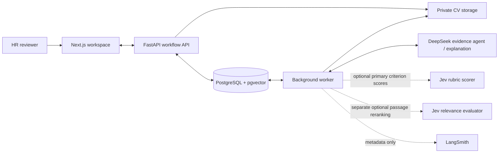
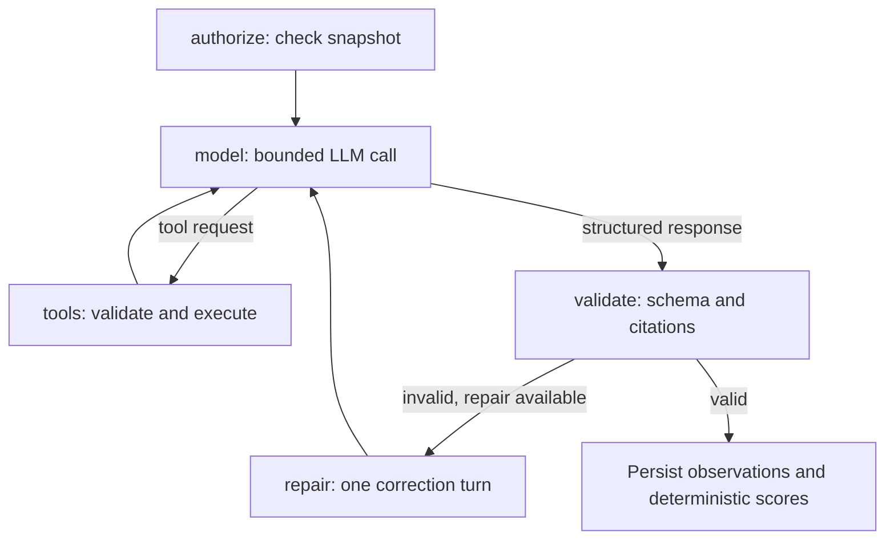

# TalentScreen AI

**A Vietnamese HR workspace for responsive, evidence-based candidate review.**

[](https://github.com/DucPh4t/TalentScreen-AI/actions/workflows/ci.yml)

[](services/backend/pyproject.toml) [](services/backend/app/main.py) [](apps/web/package.json) [](apps/web/package.json)
[](docker-compose.yml) [](docker-compose.yml)

[](#rag-and-agent-workflow) [](services/backend/app/services/agent/assessment_graph.py) [](services/backend/app/services/llm)
[](#jev-primary-scoring) [](docs/runbooks/langsmith-observability.md)

TalentScreen AI helps HR review each CV against a job description and an approved, versioned rubric. Every assessment links criterion-level observations to cited evidence, coverage, and uncertainty; HR records the final decision.

**Status:** portfolio project / local MVP with substantive workflow, safety, reliability, and evaluation tooling. It is **not a production-validated hiring system**: HR retains every hiring decision, and real-world scoring quality, fairness, and operational readiness remain unverified. Hybrid RAG V2 and Jev-primary scoring are opt-in; Jev reranking is a separate opt-in path. All are off by default.

[Engineering](#engineering-highlights) · [Architecture](#architecture) · [RAG & agent](#rag-and-agent-workflow) · [Jev modes](#jev-primary-scoring) · [Results](#evaluation-results) · [Quickstart](#quickstart) · [Code guide](#code-guide)

> Responsive candidate-review screenshots use synthetic records and were captured on **8 October 2026**. The image files are intentionally omitted from this repository.

## Engineering highlights

| Capability | Implementation | Why it matters |
|---|---|---|
| **Versioned hybrid RAG** | Local multilingual E5, pgvector cosine search, PostgreSQL lexical search, RRF, and separate V1/V2 indexes | Retrieves evidence for each approved criterion within the current CV snapshot. |
| **Optional Jev criterion scoring** | TypeSafe Jev 1.13 returns a 0–4 score distribution for criteria with validated CV citations; backend derives the fractional expected score | Separates scoring from DeepSeek's evidence extraction; scores stay advisory and non-comparable until holdout calibration. |
| **Optional evidence reranking** | Jev Choice judgments over scoped criterion–passage pairs, protected evidence selection, private journal | Separates passage relevance from applicant scoring; default off and gated by measured results. |
| **Bounded tool-calling agent** | Five-node LangGraph workflow, two read-only tools, explicit model/tool/repair limits | Searches for additional evidence without accessing other candidates or taking hiring actions. |
| **Grounded structured output** | Pydantic contracts, exact span/quote validation, criterion-scoped citations | Rejects references outside the supplied evidence; missing or conflicting evidence stays `null`. |
| **Reliable execution and cost control** | Background jobs, frozen input versions, reserve-before-call ledger, full serialized request fitting | Rejects stale results and limits outbound calls, context size, and spend. |
| **Evaluation readiness** | Local-only, SHA-pinned evaluator for independently labeled retrieval and rubric assessment | Keeps retrieval and assessment separate; reports agreement with adjudicated labels, not hiring outcomes. |

Recorded software verification from **9 October 2026**: [backend/frontend checks and production build](docs/reviews/2026-10-09-repository-cleanup.md). A separate 10 October live Jev-primary run is reported below, but its references are synthetic; no independently measured hiring-quality result is available.

## Product workflow

1. **Define the vacancy.** Enter a JD; generate or edit 2–12 weighted criteria with 0–4 anchors; approve the rubric and open applications. Sending the JD to a model for rubric drafting requires explicit egress approval.
2. **Review CVs.** Upload PDF/DOCX individually or in batches. Inspect the extracted/OCR and redacted text, then approve it before external assessment.
3. **Assess evidence.** Eligible approvals queue jobs. Review criterion observations, citations, gaps, coverage, and advisory recommendations.
4. **Screen applications.** Compare evidence and choose invite, request information, or do not continue—with a reason and versioned history.
5. **Conduct interviews.** Plan rounds, assign interviewers, edit cited questions, submit independent scorecards, and record a human conclusion.
6. **Prepare follow-up.** Edit and approve correspondence templates; manage retention and deletion requests.

The Vietnamese UI supports desktop, tablet, and phone layouts; CVs may be Vietnamese, English, or mixed-language. Original CV access is role-gated and audited. Anonymized labels, duplicate hints, and review-SLA alerts support the queue without changing capability scores.

Responsive behavior, keyboard navigation, and synthetic-browser checks: [UI verification](docs/reviews/2026-10-08-candidate-list-ux.md) · [screening and interview workflow](docs/hr-workflow.md)

## CV text extraction and OCR

PDF pages are text-extracted with `pypdf` first. If a page yields fewer than 25 characters and contains embedded images, each image is OCRed locally with Tesseract through `pytesseract` using `vie+eng`; if that call fails, the parser retries with `eng`. The parse-quality report records whether OCR ran and which pages were recovered. This is a targeted fallback, not OCR on every page.

OCR requires the system `tesseract` executable and the Vietnamese/English language data. DOCX paragraphs and tables are extracted directly; LibreOffice verifies page count, and multi-page DOCX renders go through the PDF parser. See the [parser implementation](services/backend/app/services/parser.py).

## Architecture



The backend is a **modular monolith with a separate worker process**. PostgreSQL holds workflow state, versions, vectors, audits, and invocation budgets. Slow extraction and AI work run outside HTTP requests. Search is scoped to one approved CV/configuration. The transient LangGraph has no checkpointer; PostgreSQL stores durable job/run state.

| Layer | Technology |
|---|---|
| HR workspace | Next.js 15, React 19, TypeScript, responsive CSS, PDF.js |
| API and validation | FastAPI, Python 3.12, Pydantic v2 |
| Persistence | PostgreSQL 16, pgvector, async SQLAlchemy 2, Alembic |
| Retrieval | Sentence Transformers, multilingual E5, lexical search, RRF |
| Agent and inference | LangGraph, DeepSeek HTTP adapter, explicit local mock |
| Jev scorer / reranker | TypeSafe Jev 1.13 System One API; separate primary criterion-scoring and passage-reranking modes |
| Developer observability | Optional LangSmith spans with a metadata allowlist |
| Documents and tooling | PDF/DOCX extraction, Tesseract, LibreOffice, Docker, pytest, GitHub Actions |

[Architecture walkthrough](docs/architecture.md) · [Current retrieval versions and packing rules](docs/evaluation/rag-pipeline-versions.md)

## RAG and agent workflow

**Hybrid means combining semantic and keyword retrieval.** It does not mean combining DeepSeek and Jev. The approved rubric supplies the search criteria; the approved, redacted CV supplies the evidence.

| Component | Role in this application |
|---|---|
| **Dense search** | Multilingual E5 embeddings + pgvector cosine similarity retrieve passages by meaning, including Vietnamese/English phrasing. |
| **Lexical search** | PostgreSQL full-text search with `simple` tokenization and `ts_rank_cd` retrieves matching technical vocabulary. This is not a BM25 implementation. |
| **Rank fusion** | Reciprocal Rank Fusion (`k=60`) combines the two ranked lists without mixing incompatible raw scores. |
| **Jev primary scoring (optional)** | Scores evidence-supported rubric criteria against their anchors; it is the numeric scorer only when `ASSESSMENT_SCORER_MODE=jev`. |
| **Jev evidence reranking (separate opt-in)** | Judges criterion–passage relevance before evidence selection; it does not produce the applicant's 0–4 score. |
| **DeepSeek + LangGraph** | Retrieves evidence and produces structured observations with citations; in Jev-primary mode it does not set numeric scores and may explain validated Jev scores. |
| **Backend + HR** | Validates provider output and citations, preserves the legacy deterministic scoring path, and records the human decision. |

For a SQL criterion, keyword retrieval can find `PostgreSQL`, while dense retrieval can find a differently worded account of query optimization. RRF merges these results; DeepSeek still needs cited evidence to support an observation. Retrieval matches alone do not prove competence.

### 1. Retrieve evidence against the approved rubric

The approved rubric's labels, descriptions, anchors, and bilingual terms drive retrieval over the approved, redacted CV.

1. Preserve canonical source spans for immutable citation targets.
2. Build a versioned index. **V1** groups adjacent section-local spans; **V2** indexes individual spans and deduplicates exact repeated text within a section. Both split oversized spans losslessly at 480 tokens.
3. Encode passages/queries with pinned `intfloat/multilingual-e5-base`, using `passage: ` / `query: ` prefixes and normalized **768-dimensional vectors**. CPU, Apple MPS, and CUDA are supported.
4. Fuse dense and lexical ranks using **RRF, k=60**. V2 prioritizes approved bilingual skill terms in an 800-character query and retrieves up to 30 candidates per channel; V1 retains its legacy query and ten-candidate pool.
5. The separate **Jev evidence-reranking** path can evaluate criterion–passage pairs before selecting up to four chunks per criterion. Off keeps RRF; shadow observes; rerank changes selection; hard gating is restricted to internal synthetic experiments. It does not replace Jev-primary scoring. [Limits and rollback](docs/runbooks/jev-reranking.md).
6. Select up to four section-diverse chunks per criterion, resolve canonical spans, and fit the complete model request. Each turn is bounded to **65,536 UTF-8 bytes** and **24,000 unique evidence characters**. Eviction removes whole spans and updates citation scope; quotes are never shortened.

Versioned indexes coexist. New runs pin their retrieval/embedding configuration and packing version; older snapshots retain V1 retrieval. Hybrid failures produce an explicit failed/manual-review path, without silently switching to full-text or another provider.

### 2. Use tools only when additional evidence is needed



| Tool | Allowed operation | Boundary |
|---|---|---|
| `retrieve_more_evidence` | Search for evidence using a validated technical query hint | Current approved CV; at most four approved criterion IDs per request. |
| `get_source_spans` | Read exact text for retrieved evidence | At most eight span IDs exposed by the preceding retrieval, within the same snapshot. |

The graph permits **two tool executions, three normal model turns, and one repair** for DeepSeek scoring. Jev-primary mode caps the evidence agent at at most three DeepSeek turns with no schema-repair call, preserving one of the **four total call slots** for Jev scoring; a DeepSeek explanation is optional if capacity remains. Reranking mode has separate limits of **four primary, nine Jev, and thirteen total calls**, including admitted/failed calls. Scope/limit violations stop execution. Tools cannot browse externally, write decisions, or send messages. Optional LangSmith traces export metadata, not CVs, prompts, model responses, or query text.

### 3. Validate observations before calculating scores

The backend validates structured observations and exact citations before Decimal-based scoring. **Observed score**, **coverage**, and **comparable score** stay separate; comparability requires complete assessment without missing/conflicting criteria. Valid citations do not prove correct interpretation—HR reviews the evidence and reasoning.

## Jev primary scoring

With `ASSESSMENT_SCORER_MODE=jev`, DeepSeek drafts a rubric from the JD and uses bounded, scoped retrieval to produce score-free observations with citations. The backend validates the citations; Jev scores evidence-supported criteria against approved anchors, and the backend validates and stores the probability distribution separately from historical integer scores. DeepSeek may explain validated scores and propose follow-up questions, but cannot change scores or make hiring recommendations. A run is capped at four external calls. Jev-primary mode is off by default, requires separate DeepSeek and TypeSafe credentials plus explicit processor approval, and does not create a comparable shortlist score until a labeled holdout passes calibration. See [architecture and gates](docs/architecture.md) and [.env.example](.env.example).

Jev receives criterion-scoped questions in one bounded batch. The TypeSafe request format shares one CV-scoped state across those questions, so prompt instructions and backend provenance validation constrain each answer but do not technically isolate one criterion's reasoning from another. This limitation must be evaluated in the labeled holdout.

## Jev evidence reranking

**This section covers passage reranking only.** In this mode Jev 1.13 classifies criterion–passage relevance; it does not produce the applicant's 0–4 criterion score. The separate primary-scoring path is described above.

**Which score?** Jev returns passage-category probabilities. The backend derives a relevance utility to rank evidence, not an applicant's 0–4 criterion score or overall fit score. Enabled reranking can indirectly change the primary assessment by changing the evidence shown to DeepSeek; Jev does not replace that assessment or the deterministic scoring rules.

**Does it save money?** Cost reduction is a hypothesis, not a verified result here. Reranking adds Jev calls and latency; both baseline and rerank select up to four chunks per criterion. A different evidence pack may affect primary token use, but lower total cost must be demonstrated in a controlled comparison that includes both providers. Current experiments do not establish net savings.

Each approved criterion–passage pair receives one of five categories: `substantive_evidence`, `mention_only`, `limiting_evidence`, `unrelated`, or `unclear`. Selection protects a limiting passage and an unscored passage when available, but these protections do not guarantee complete negative/conflicting evidence retention.

| Mode | Effect on the evidence pack | Current use |
|---|---|---|
| `off` | Baseline RRF selection; no Jev calls | Recommended default |
| `shadow` | Record judgments while retaining baseline selection | Controlled observation |
| `rerank` | Change passage order and selection | Opt-in, pending activation evidence |
| `gate_experiment` | Also omit highly confident unrelated passages | Internal synthetic sandbox only |

Calls have bounded batch/request sizes, reserve-before-call accounting, and a private run-scoped journal. Ambiguous provider outcomes retain their reservation and cannot be replayed automatically. HR sees an evidence-review notice when applicable; developer metadata goes to optional LangSmith traces.

Jev scoring and evidence reranking are separate, optional provider paths. Keep them disabled unless data-processing permission, a current rate card, and independent evaluation gates are satisfied. The repository contains no current independent evidence that either path improves hiring decisions.

[Configuration, limits, and rollback](docs/runbooks/jev-reranking.md) · [Human-labeled evaluation protocol](docs/evaluation/independent-human-evaluation-design.md)

## Evaluation results

### Live Jev-primary synthetic run — 10 October 2026

One `hybrid_agent` profile ran on 100 synthetic CV-like cases across five role families. Jev 1.13.0 produced numeric criterion scores; DeepSeek `deepseek-flash` handled evidence extraction/status and optional explanations; Jev reranking was off.

| Evaluation area | Metric | Result | Denominator |
|---|---|---:|---:|
| Retrieval | Span Recall@5 | 44.54% | 476 criterion-level retrieval observations |
| Retrieval | Span Recall@10 | 99.58% | 476 criterion-level retrieval observations |
| Retrieval | Sufficient-evidence-group coverage | 100.00% initial and final | 476 positive criteria |
| Evidence grounding | Annotated citation precision | 84.74% | 603 citations |
| Jev numeric scoring | Mean absolute error (MAE) | 0.0963 on a 0–4 scale | 342 numeric score pairs |
| Assessment status | Exact status agreement | 91.48% | 528 criteria in accepted cases; not a Jev numeric-score metric |
| Abstention | Correct abstention / false zero / unsupported score | 89.81% / 0.00% / 9.55% | 157 null-reference criteria |

The pipeline accepted **88/100** cases; 6 failed and 6 were skipped. Jev scoring ran successfully for **87** cases; one accepted case had no evidence and made no Jev call. The run recorded 309 model calls (87 Jev, 222 DeepSeek) and a **$0.48056 peak-rate cost estimate**; provider invoice data was unavailable.

These are results against deterministic synthetic design expectations, not HR/IT-reviewed labels. The dataset's nominal public-test split is not protected, all 100 cases were evaluated, and the run used one repetition. The metrics do not establish accuracy on real applicants, fairness, hiring outcomes, or production readiness.

See the [full report](docs/evaluation/jev-primary-synthetic-100-2026-10-10.md) for per-role and language slices, failures, metric definitions, dataset hashes, provider configuration, and limitations. The [dataset and generator](fixtures/ai_benchmark/synthetic_100_multi_role_v2/) are public test fixtures, not a human gold set.

The independent human-label protocol remains a separate, unrun evaluation track: independent JDs, approved real evaluation data, and blinded HR/IT labels are still required before making hiring-quality claims. See the [protocol and metric definitions](docs/evaluation/independent-human-evaluation-design.md), [annotator instructions](docs/evaluation/human-evaluation-annotator-guide.md), and [package schema](schemas/evaluation/human-evaluation-v1.schema.json).

## Quickstart

Run commands from the repository root. Requirements: **Python 3.12**, **uv**, **Node.js 20+**, npm, and Docker with Compose v2. Install LibreOffice for DOCX page validation and Tesseract with English/Vietnamese language data for scanned CVs.

### 1. Install and initialize

```bash
git clone https://github.com/DucPh4t/TalentScreen-AI.git
cd TalentScreen-AI
cp .env.example .env
make bootstrap
```

Generate a signing key with `openssl rand -hex 32` and set `SECRET_KEY` in `.env`. The first run can use the default `LLM_PROVIDER=mock`, with no external LLM calls. Credentials and candidate files remain outside Git.

```bash
make doctor
docker compose up -d --wait postgres
.venv/bin/alembic upgrade head
```

### 2. Create a local account

Choose a password interactively; this snippet creates or updates `local-admin` without putting the password in shell history.

```bash
PYTHONPATH=services/backend .venv/bin/python - <<'PY'
import asyncio
import getpass
from app.cli import create_admin

asyncio.run(create_admin(
    login="local-admin",
    password=getpass.getpass("Admin password: "),
    display_name="Local Administrator",
))
PY
```

### 3. Start API, worker, and frontend

Use one terminal for each command:

```bash
make dev-backend
make dev-worker
make dev-web
```

Open [localhost:2004](http://localhost:2004) and sign in as `local-admin`. API docs: [127.0.0.1:8000/docs](http://127.0.0.1:8000/docs). If port 8000 is occupied, pass the same `BACKEND_PORT=8001` to both `make dev-backend` and `make dev-web`.

Keep the worker running for extraction/assessments. Follow the [HR workflow](docs/hr-workflow.md) to create a vacancy and try a synthetic CV.

### 4. Enable RAG V2 and a live provider

| Setting | Repository default | Optional configuration |
|---|---|---|
| `LLM_PROVIDER` | `mock` | Set `deepseek`, configure `DEEPSEEK_API_KEY`, `DEEPSEEK_MODEL`, and provider/budget settings. |
| `ASSESSMENT_SCORER_MODE` | `deepseek` | Keep default for existing behavior. `jev` opts new runs into Jev's fractional 0–4 scoring and requires an approved TypeSafe processor plus a current verified rate card. |
| `RAG_MODE` | `full_text_baseline` | Set `hybrid` for E5 + lexical/vector retrieval. |
| `RAG_PIPELINE_VERSION` | `v1` | Set `v2` for the improved span index and bilingual query; `v1` rolls back new runs. |
| `EMBEDDING_DEVICE` | `auto` | Explicit `cpu`, `mps`, or `cuda` when needed. |
| `LANGSMITH_TRACING` | `false` | Enable developer metadata traces after configuring your own key/project. |
| `JEV_RERANK_MODE` | `off` | Keep off for normal use; see the [Jev runbook](docs/runbooks/jev-reranking.md) for controlled experiments. |

Restart **API and worker** after changing settings. Hybrid first use may download pinned E5 weights; offline benchmarks require a populated cache. Provider configuration alone does not verify live inference.

For a controlled synthetic Jev-primary run, first enable DeepSeek as the evidence/explanation provider, then set `ASSESSMENT_SCORER_MODE=jev`, `JEV_DATA_PROCESSING_APPROVED=true`, and a current `JEV_RATE_CARD_VERIFIED_AT` with the verified input price. Keep `JEV_MODE=off` and `JEV_RERANK_MODE=off`; the app rejects conflicting Jev purposes. Never enable this path for applicant CVs until the institution has approved TypeSafe for that processing. Restart both API and worker.

Jev has two distinct opt-in paths: `ASSESSMENT_SCORER_MODE=jev` uses DeepSeek for the bounded evidence agent and post-score explanation, then one direct TypeSafe Jev 1.13 call for evidence-supported rubric criteria; `JEV_RERANK_MODE` is a separate retrieval experiment. They cannot run together. Jev scores are stored separately from historical DeepSeek integer scores, use a probability-weighted expected value, and remain HR-only proposals with no comparable shortlist score until a labeled holdout calibrates activation gates. Provider errors never fall back to DeepSeek scoring. Both paths require the official TypeSafe endpoint `https://api.typesafe.ai/v1/systemone`, a pinned model, processor approval and a current verified rate card. OpenRouter routing is not supported. Never copy an expired rate date from an old report. [Full configuration](.env.example).

## Verification and evaluation commands

```bash
# Disposable PostgreSQL/pgvector DB, backend tests, frontend tests and build.
make test

# Local-only evaluator interface. A populated, approved package is required.
PYTHONPATH=services/backend .venv/bin/python scripts/evaluate_human_labels.py --help
```

The evaluator verifies the exact annotation-package SHA-256 and source snapshot, validates blinded double annotations and split isolation, and emits aggregate-only JSON. No independently labeled HR/IT package is available. The synthetic run above measures behavior against designed references only; it does not establish hiring quality. CI tests backend/frontend behavior and builds Next.js with external providers/tracing disabled.

## Code guide

| Start here | Review focus |
|---|---|
| [Embedding/indexing](services/backend/app/services/embedding.py) → [retrieval](services/backend/app/services/retrieval.py) | Immutable span targets, index versioning, document filters, query construction, RRF. |
| [LangGraph](services/backend/app/services/agent/assessment_graph.py) → [tools](services/backend/app/services/agent/tools.py) | Authorization, bounded tool calls, stale inputs, validation and repair. |
| [Request fitter](services/backend/app/services/agent/request_budget.py) → [invocation ledger](services/backend/app/services/llm/ledger.py) | Complete UTF-8 request accounting, whole-span eviction, budget reservation and settlement. |
| [Prompts](services/backend/app/services/assessment/prompt.py) → [validator](services/backend/app/services/assessment/validator.py) → [scoring](services/backend/app/services/assessment/scoring.py) | Versioned prompts, exact citations, deterministic scoring and abstention. |
| [Jev reranking](services/backend/app/services/reranking) → [reranking evaluation contracts](services/backend/app/services/evaluation/benchmark/reranking.py) | Pair contracts, protected selection, resumable journals, provider-aware budgets, and activation gates. |
| [Human-labeled evaluator](services/backend/app/services/evaluation/human_labeled.py) | Separate retrieval/assessment metrics, double-blind label validation, pinned local sources, and aggregate-only output. |

```text
apps/web/                     Next.js HR workspace
services/backend/app/
  api/v1/                     Workflow and authentication endpoints
  services/agent/             LangGraph and scoped evidence tools
  services/assessment/        Prompts, validation, scoring and snapshots
  services/llm/               Provider adapters and invocation ledger
  services/reranking/         Optional Jev passage judgments and selection
  services/evaluation/        Human-label metrics and legacy regression contracts
services/backend/alembic/      Database migrations
services/backend/tests/        Regression and integration tests
scripts/                      Local tooling, including the human-label evaluator
fixtures/                     App seeds and synthetic software-regression fixtures
docs/                         Architecture, evaluation protocol, workflow and runbooks
```

## Scope and next validation

Next: bounded live V2/tool-recovery evaluation, independent HR/IT labels, and operational verification. Email delivery, ATS/calendar integrations, and dossier export remain future work. Interview conclusions do not create offers. Public deployment and real-data use require the [G1–G7 readiness gates](docs/runbooks/rag-agent-readiness.md).

[Detailed workflow](docs/hr-workflow.md) · [Verification map](docs/verification.md) · [LangSmith setup](docs/runbooks/langsmith-observability.md) · [Full configuration](.env.example)

<details>
<summary>Giới thiệu tiếng Việt</summary>

TalentScreen AI hỗ trợ HR rà soát CV theo JD/rubric bằng hybrid retrieval và agent LangGraph có giới hạn. DeepSeek tìm/trích evidence; Jev có hai chế độ riêng: chấm điểm tiêu chí hoặc xếp hạng mức liên quan của đoạn CV. Điểm AI chỉ tham khảo, HR quyết định cuối cùng. Báo cáo 100 case hiện dùng dữ liệu synthetic, chưa được HR/IT xác nhận và không chứng minh độ chính xác tuyển dụng thật.

</details>
