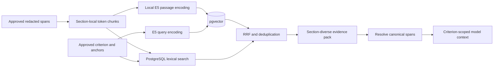
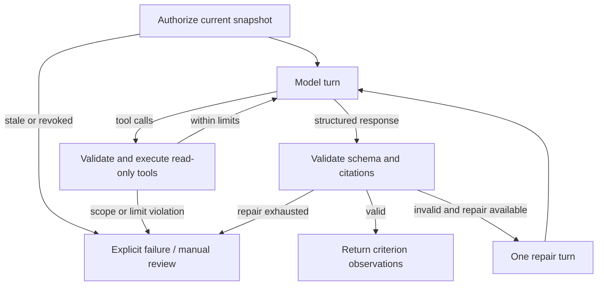

# Architecture walkthrough

TalentScreen AI is a modular FastAPI backend, a Next.js HR workspace, and a separate background worker sharing PostgreSQL/pgvector and private document storage. This document describes implemented behavior; institutional approval and model-quality validation are tracked in the [readiness gates](runbooks/rag-agent-readiness.md).

## Components and responsibilities

| Component | Owns | Boundary |
| --- | --- | --- |
| Next.js workspace | Navigation, requisitions, CV/evidence views, human review | Backend enforces authorization and workflow preconditions. |
| FastAPI API | Request validation, access checks, workflow commands | Does not delegate permission or applicant selection to a model. |
| PostgreSQL | State, immutable versions, spans, vectors, jobs, invocation ledger, audit records | Retrieval/tools filter by authorized document/version before ranking. |
| Private storage | Uploaded documents and processing artifacts | Raw access is explicitly controlled; documents are not repository assets. |
| Worker | Extraction/OCR, indexing, assessment, interview processing, queued data operations | Runs independently of HTTP requests and records status/failure codes. |
| Provider adapters | DeepSeek primary, local mock, optional Jev secondary shadow or evidence reranking | Structured validation and deterministic policy run in the application. |

A database-backed queue avoids requiring Redis or a separate message broker in the local MVP. A modular monolith reduces deployment overhead while retaining boundaries around documents, retrieval, assessment, decisions, and providers. Multi-worker load behavior still requires representative operational testing.

## Document provenance and snapshots

A CV upload produces a document version. Extraction normalizes its text; sanitization produces a reviewable redacted version with canonical source spans. HR approval is required before candidate-derived external assessment.

An assessment records application/document/redacted-version/rubric identifiers, application generation, source hash, retrieval strategy, and prompt versions. Tools recheck this snapshot against current state. Deletion, approval revocation, or a version change invalidates work; late output must not overwrite the current application.

The run snapshot records the retrieval strategy; it does not freeze every embedding/chunker/RRF parameter. Indexed chunks record the embedding configuration ID, and model/retrieval revisions are included in benchmark manifests. Fully reproducible historical reruns across runtime configuration changes remain a limitation.

Chunks point to canonical source-span IDs. Chunking serves search; the citation target remains the registered canonical span. A quote is validated against that span's complete text rather than a model summary.

## Retrieval

The hybrid implementation uses:

- `intfloat/multilingual-e5-base` pinned to a revision, 768-dimensional normalized vectors, and query/passage prefixes.
- Adjacent spans grouped within a section, targeting 300 tokens and bounded at 480. Oversized spans split into exact substrings; no sliding-window overlap is added.
- Queries built from labels, descriptions, approved bilingual terms, and rubric anchors. PostgreSQL's `simple` lexical configuration retains technical terms; it is not a language-specific semantic analyzer.
- Up to ten candidates per dense/lexical channel. RRF sums `1 / (60 + rank)` with deterministic tie-breaking.
- Up to four section-diverse chunks per criterion, cross-criterion deduplication, and a 24,000-character chunk-evidence budget. Canonical-span expansion is also checked against assessment context limits.
- Filters for the exact sanitized version and embedding configuration before ranking. No cross-applicant corpus search is exposed to the model.

**Trade-offs:** sharing pgvector/lexical search with the workflow database keeps setup simple. Exact document-scoped vector ordering suits a small CV corpus; the code does not claim an approximate-nearest-neighbor scaling benchmark. RRF combines rankings without training a reranker, but relevance still needs role-specific evaluation. Multilingual embeddings address the Vietnamese/English use case; a mixed-language chunking test does not prove scoring quality.

The full-text baseline uses approved CV spans without E5 retrieval. Hybrid errors fail explicitly; selecting a new baseline/manual path is an operational choice, not a silent fallback within a failed run.

Sources: [embedding.py](../services/backend/app/services/embedding.py), [retrieval.py](../services/backend/app/services/retrieval.py), [assessment service](../services/backend/app/services/assessment/service.py).

## Bounded agent state machine

The graph is a transient LangGraph `StateGraph`; it has no checkpointer and does not promise to resume from an individual model turn after a crash. PostgreSQL stores job/run state and minimized execution metadata.

1. `retrieve_more_evidence` accepts approved criterion IDs and a bounded, validated technical query hint. It searches only the authorized sanitized CV version.
2. `get_source_spans` resolves up to eight canonical span IDs exposed by the preceding retrieval. The graph checks eligibility/provenance in addition to database scope checks.

Limits are two tool executions, three normal model turns, and one validation repair, with a default four-call assessment ceiling enforced by the invocation orchestrator. The repair turn has no tools. Snapshot checks occur before subsequent model work, and the service rejects stale final results.

The baseline also runs through the bounded graph for response validation; additional retrieval tools are offered only in hybrid mode. Prompts treat CV content as untrusted. Tool-name, argument, criterion, and span validation enforce the executable boundary independently of the prompt.

Sources: [graph](../services/backend/app/services/agent/assessment_graph.py), [tools](../services/backend/app/services/agent/tools.py), [tests](../services/backend/tests/test_assessment_agent.py).

## Output validation and scoring

| Model state | Score | Required behavior |
| --- | --- | --- |
| `assessed` | Integer 0–4 | Evidence and rationale aligned to approved anchors. |
| `insufficient_evidence` | `null` | Explicit information gap and clarification question. |
| `conflicting_evidence` | `null` | Conflicting citations and a request to verify. |

The backend validates criterion membership/completeness, schema, span ownership, per-criterion retrieval eligibility, and exact quotes. Citation validity does not establish semantic correctness; that requires evidence review and labeled evaluation.

The deterministic policy calculates coverage (assessed weights / 100), observed score (weighted assessed score normalized over assessed weights), comparable score (complete coverage without missing/conflicting criteria), and advisory recommendation (approved thresholds/core floors with reason codes).

These stay separate from the final human decision. HR revisions retain justification; interview scorecards are separate observations. Prompt versions resolve from a committed registry and are bound to each run; unknown versions fail closed. This is versioned code/configuration, not an online prompt-management service.

Sources: [prompts](../services/backend/app/services/assessment/prompt.py), [validator](../services/backend/app/services/assessment/validator.py), [scoring](../services/backend/app/services/assessment/scoring.py).

## Provider execution and spend

Calls pass through preconditions, budget reservation, invocation recording, network execution, and settlement. Estimates include messages and tool schemas. A requisition cap complements global/environment budgets; database reservations account for concurrent work.

If a timeout or unusable response leaves billing uncertain, the reservation remains an unknown outcome pending reconciliation. Estimates are not invoice evidence. Provider settings, approval requirements, verified rate cards, and call ceilings require operational checks.

DeepSeek is the configurable default provider. Mock is the explicit local default, not an automatic replacement for a failed live provider. New runs may opt into `ASSESSMENT_SCORER_MODE=jev` after provider approval: DeepSeek emits an evidence-only result, Jev 1.13 scores supported criteria once, the backend normalizes rounded probabilities and validates the exact model and score distribution, then DeepSeek may explain the pinned Jev scores and draft follow-up questions. Jev score fields remain separate from legacy integer scores; no-evidence criteria are not sent to Jev; errors do not fall back to DeepSeek scoring. Jev-primary runs share a four-call total ceiling: the evidence agent gets at most three DeepSeek turns and no schema-repair call, reserving a slot for Jev; the DeepSeek explanation runs only if capacity remains. Until labeled holdout calibration exists, they always require HR review and never produce a comparable shortlist score.

The TypeSafe batch contract shares the approved CV-scoped state among its criterion questions. Each question includes only its own rubric anchors and directs Jev to use only that criterion's evidence, while the backend verifies evidence provenance before constructing the request. The shared state means reasoning is not technically isolated per criterion; evaluate cross-criterion influence in the labeled holdout before considering production use.

Sources: [orchestrator](../services/backend/app/services/llm/orchestrator.py), [ledger](../services/backend/app/services/llm/ledger.py), [adapters](../services/backend/app/services/llm/provider.py).

## Evaluation and deployment boundary

The benchmark accepts schema-limited rows and version manifests. It reports criterion-scoped retrieval/citation metrics, per-role/provider agreement, counterfactual checks, candidate-cluster bootstrap intervals, timing, and cost. Public fixtures are synthetic and visible; the CLI holdout flag is procedural friction, not access control.

Dockerfiles and Compose configurations are present. Local software verification, independent hiring-quality validation, and public deployment readiness are separate checks. See [verification evidence](verification.md), [independent human-labeled evaluation protocol](evaluation/independent-human-evaluation-design.md), and [readiness gates](runbooks/rag-agent-readiness.md).

## Optional passage reranking

Hybrid V2 can pass its full RRF candidate pool to a bounded Jev Choice evaluator before selecting the evidence pack. Approved criterion descriptions and exact approved CV passages form independent pairs. The classifier distinguishes substantive, limiting, mention-only, unrelated, and unclear evidence; it does not set capability scores. Initial and agent-tool retrieval share the same run-scoped service.

The frozen run policy controls endpoint, accepted served identities, rate provenance, body/time/call bounds, and selection. Atomic provider-aware admission commits budget and invocation records before HTTP. The private nullable `AssessmentRun.rerank_output` journal survives process restarts but never serializes raw CVs through the HR API. Missing historical policy fields retain off behavior and legacy snapshot hashes.

`shadow` preserves baseline packing; `rerank` changes selection; `gate_experiment` requires both sandbox and an internal synthetic execution policy. Default is off. Unknown billing outcomes are held, not retried or silently cleared. An evidence-review notice appears when the authorized active result reports omitted limiting evidence. [Operational boundaries and rollback](runbooks/jev-reranking.md).
