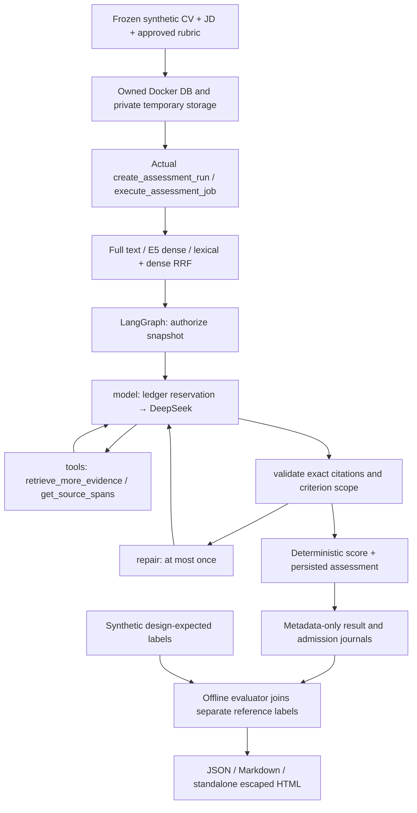

# Reproducing the production-pipeline AI benchmark

This developer tool calls `create_assessment_run` and `execute_assessment_job`, including actual retrieval, the LangGraph, output validator, deterministic scorer and invocation ledger. The public HR API does not accept experimental profiles. Existing production prompt versions and defaults retain their meaning.

## What is measured

| Profile | Initial evidence | Evidence tools |
| --- | --- | --- |
| `full_text` | Approved canonical CV spans, bounded to 24,000 evidence characters | Disabled |
| `dense` | Multilingual E5 + scoped pgvector cosine search | Disabled |
| `hybrid` | Dense + PostgreSQL lexical search, RRF k=60 | Disabled |
| `hybrid_agent` | Same hybrid pack | Up to two read-only executions |

All profiles share rubric/CV versions, prompt `assessment-v1.6.0` + `assessment-agent.v1`, schema, temperature 0, thinking disabled, output limit 4,096 tokens and scoring policy. Profile order is shuffled with seed 20261008, concurrency 1, one repetition. The neutral prompt is immutable; comparing different prompts would confound retrieval effects.



The five graph nodes are authorize/model/tools/validate/repair. Tools cannot send messages, browse externally or make hiring decisions. Each run permits at most three normal model turns plus one repair, with at most four outbound requests. A zero-tool outcome is valid; it is not evidence that the agent recovered missing information.

## Dataset and labels

`fixtures/ai_benchmark/v1` contains 60 authored synthetic CVs: 20 Backend Node.js, 20 AI/ML, 20 Android. Each role includes 7 Vietnamese, 7 English and 6 mixed-language CVs. It includes anchor levels, missing information, skills/team-only assertions, contradictory evidence, repeated bilingual evidence, identity counterfactuals, buried evidence and prompt injection.

The 36 development and 24 public-test cases keep identity variants in the same cluster/split. Public fixtures and synthetic design expectations are **not protected holdout or independent HR judgments**. Template repetition and short CVs constrain generalization. Reference explanations contain an evaluator-only sentinel; runner/model/tool inputs do not receive labels. File and manifest hashes are checked before execution and every provider request.

## Local prerequisites

Run from the repository root. Install backend dependencies from the existing lockfile, start Docker and install LibreOffice for PDF/DOCX smoke tests. The `.env` remains untracked. Mock requires no cloud key. Live execution uses the configured **direct DeepSeek endpoint**, `deepseek-flash`, and existing API key; Jev is forced off in the child. OpenRouter is not a supported route for this benchmark's verified rate card.

Real embedding runs require the cached `intfloat/multilingual-e5-base` snapshot. The benchmark resolves the local alias to an immutable cache SHA and pins it in the child. On the measured Mac run it was `d128750597153bb5987e10b1c3493a34e5a4502a`, device `mps:0`, 768-dimensional normalized vectors. The wrapper sets offline Hub/Transformers flags before imports. It never silently downloads weights or changes the user's `.env`.

To populate a new machine's cache deliberately, install the embedding dependencies and explicitly load that pinned revision once, before running with offline flags. This is a separate setup action, not a benchmark result.

A defensible byte-bound requires the official tokenizer artifacts described in [the bound proof](deepseek-token-bound.json). Download `tokenizer.json` and `encoding.py` from the proof's pinned DeepSeek repository/revision into ignored `reports/ai-benchmark-cache/`. `encoding.py` is parsed as AST only, never executed. SHA verification, tokenizer structure and request grammar are checked. Missing/changed artifacts select the conservative context bound; unaffordable live scope is rejected.

## Commands

```bash
# Validate all inputs and reference citations. No model calls.
.venv/bin/python scripts/run_ai_benchmark.py validate --dataset fixtures/ai_benchmark/v1

# Offline planning: no provider call or weight download.
.venv/bin/python scripts/run_ai_benchmark.py plan \
  --dataset fixtures/ai_benchmark/v1 --provider deepseek --profiles all \
  --cases node-01,ai-01,android-01 --max-cost-usd 5

# Contract smoke: 12 actual service runs, LLM and embedding test doubles.
bash scripts/run_ai_benchmark_isolated.sh run \
  --dataset fixtures/ai_benchmark/v1 --provider mock --profiles all \
  --cases node-01,ai-01,android-01 --embedding-mode scripted \
  --max-cost-usd 5 --output reports/ai-benchmark/new-contract-smoke

# Real retrieval measurement over all 60 cases; LLM quality unmeasured.
bash scripts/run_ai_benchmark_isolated.sh run \
  --dataset fixtures/ai_benchmark/v1 --provider mock --profiles all \
  --split all --embedding-mode real --max-cost-usd 5 \
  --output reports/ai-benchmark/new-offline-rag

# PAID: one new experiment, explicit admission and shared USD5 cap.
bash scripts/run_ai_benchmark_isolated.sh run \
  --dataset fixtures/ai_benchmark/v1 --provider deepseek --profiles all \
  --cases node-01,ai-01,android-01 --embedding-mode real \
  --max-cost-usd 5 --output reports/ai-benchmark/new-live-probe

# Regenerate reports from journals, offline. No provider construction/call.
.venv/bin/python scripts/run_ai_benchmark.py report \
  --input reports/ai-benchmark/new-live-probe \
  --output reports/ai-benchmark/new-live-probe --dataset fixtures/ai_benchmark/v1

# Actual 6 PDF + 6 DOCX through intake, extraction and PII redaction.
bash scripts/test_backend_isolated.sh services/backend/tests/test_ai_benchmark_documents.py

# Explicit cached real-weight/pgvector smoke; no LLM call.
TALENTSCREEN_REAL_E5_SMOKE=1 HF_HUB_OFFLINE=1 TRANSFORMERS_OFFLINE=1 \
  bash scripts/test_backend_isolated.sh services/backend/tests/test_ai_benchmark_real_embedding.py -s
```

Profiles may be a comma-separated subset. `--cases` and `--split` are mutually exclusive; the default split is development. A run output directory must be new; there is no paid resume. A report may replace only generated report files atomically. Exit codes: 0 complete, 2 invalid/preflight, 3 partial/failed experiment, 130 interruption.

## Isolation, financial uncertainty and tracing

The wrapper owns the exact labeled container ID, random database credentials, DB ownership comment/nonce and marked temporary storage. Names or an environment toggle alone cannot authorize mutation. It applies migrations only to that DB and stops only its owned container. It does not read real Downloads CVs, mutate the application's database or attest that a human approved a synthetic fixture.

One DEVELOPMENT budget period caps the whole experiment across requisitions. Every outbound call reserves first, then records a fsynced metadata-only admission. Unknown outcomes/missing usage/model mismatches retain funds and stop further calls. Zero usage remains zero; absent cache usage remains unmeasured and uses conservative miss pricing. Reported costs are **peak-rate token estimates**, not provider invoices.

SIGINT/TERM forwards cancellation to the child, writes partial records/financial state, then cleans up. A hard kill leaves a running manifest and unresolved admissions: reports flag uncertainty, never silently infer free calls. No automatic retry starts another fresh paid experiment. Full 60×4 live preflight exceeds the initial USD5 cap under the conservative four-call bound; the measured 12-combination probe is not that full experiment.

Manual LangSmith spans export fixed enums/counters, experiment UUID, hashed case ID and opaque run IDs, with empty inputs/outputs. Automatic graph-state capture remains suppressed. Local trace IDs do not prove cloud ingestion; verify the service separately. Tracing outages do not alter assessment results. Reports omit CV/prompt/response/rationale/error bodies and render all report strings inertly.

## Reading the metrics

- Reliability includes planned, attempted, accepted, failed, skipped, interrupted and missing records.
- Numeric MAE/kappa use only pairs with numeric expected/observed anchors; `null/null` never inflates agreement. Degenerate kappa is null.
- Status agreement has accepted-only and all-planned denominators. Conflicts, correct abstention, false zero and unsupported scores have separate denominators.
- Span Recall@5/10 flattens/deduplicates the **ranked pre-pack chunk pool**, then takes the first k spans. Source order within a chunk can place a relevant span beyond k. This is not chunk Recall@k.
- Sufficient-group coverage checks all spans in an alternative group, in the delivered initial/final pack. It may be 100% even when span Recall@10 is lower. Full-text ranking is unmeasured.
- Paired deltas use only overlapping accepted cases, cluster bootstrap (1,000 samples, recorded seed). Too-small/degenerate intervals are null. Counterfactual rates require complete pairs.
- Setup/model device is separate from per-run timing; indexing is reused for the same approved snapshot. One shuffled run cannot establish stable latency differences or model variance. Queue time/invoice are unmeasured.
- Mock validates pipeline contracts; model accuracy, human agreement and live tool-recovery remain unmeasured. Real E5 retrieval can be measured independently of the mock LLM.

See [measured results](ai-benchmark-results-2026-10-09.md) for the exact observed scope and limits.
