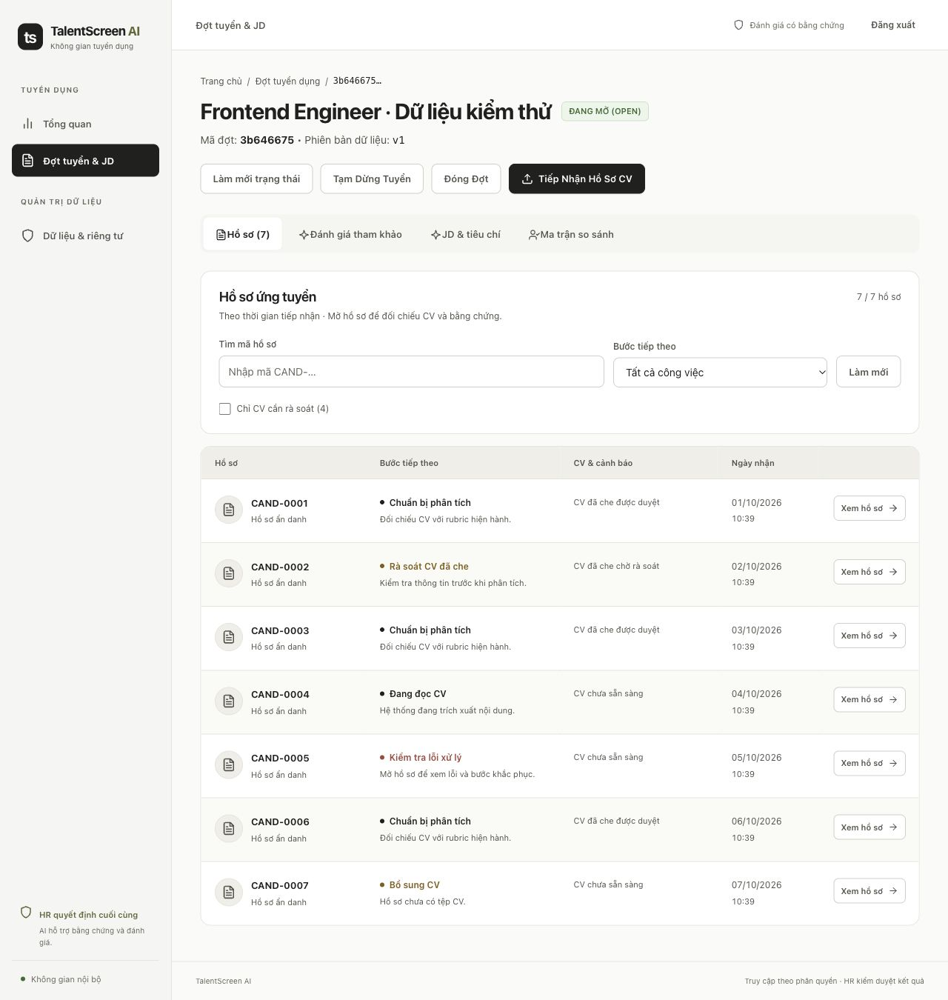
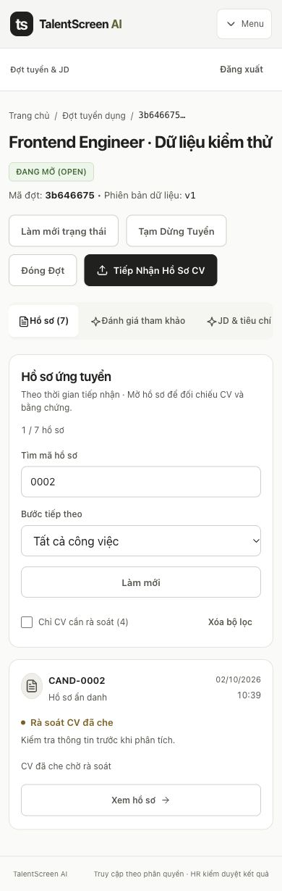

# Candidate-list UI refinement

Date: 2026-10-08. Based on main commit `77169ec`, with this local UI change.

The supplied reference was a HireBrief-style candidate table. Its useful patterns are a persistent sidebar, searchable list and a clear row action. TalentScreen uses the user-requested warm white/gray palette, black active navigation and muted olive accents. Anonymous review, evidence checks and HR decisions remain part of the workflow. Internal email hashes and repeated rejection-history badges are not copied from the reference.

## Implemented

- Five desktop columns: anonymous application, next task, CV/privacy warnings, received date and an explicitly named link.
- Responsive cards at smaller widths, with full-width mobile links and one visible accessible representation.
- Candidate-code search, task filter, CV-review filter, result count, reset and a useful no-match state.
- Processing state is taken from workflow metadata; the existence of an old assessment pointer no longer yields the misleading “Có bản đánh giá” badge in this list.
- Independent reviewers retain a neutral independent-review task/link; no AI task cues are rendered for them.
- Queue outages disable metadata filters without hiding otherwise accessible applications.
- Existing duplicate/SLA warnings remain advisory. No identity resolution, scoring, permission or decision rule was changed.
- Frontend unit tests are part of `npm test`, `make test` and GitHub Actions.

## Initial list verification

- `npm test`: 6 passed. Tests cover filtering/FIFO, combined filters/no matches, queue failure, old assessment pointers, blind-review presentation and inactive applications.
- `npm run build`: production compilation, TypeScript validation and eight application routes completed successfully.
- Browser testing used a separate disposable PostgreSQL/pgvector database, mock provider, synthetic records and temporary frontend/API processes. The real candidate DB and production user credentials were not used.
- Authentication succeeded against the synthetic account; the requisition list rendered seven records in FIFO order.
- A missing search returned `0 / 7` and a reset action. The awaiting-decision filter returned exactly one record; CV-review-only returned two records.
- At 1440 px the desktop table was visible, with no page overflow. At 820, 390 and 320 px exactly seven cards were visible, the desktop table was hidden, document width equaled viewport width, and every card link was 44 px high.
- Keyboard Tab moved from the search box to the task selector.
- Read-only peer review found no substantive bugs in the list change.

These are UI/workflow checks, not a live-provider scoring or hiring-quality evaluation. This UI pass changes no backend service or migration. The earlier full backend result is documented separately in [workflow repairs](2026-10-08-workflow-repairs.md).

## Warm neutral restyle verification

The following checks were repeated after the new palette was applied:

- `npm test`: 8 passed, including two new regressions preventing unassessed or partially covered shortlist entries from claiming complete evidence.
- `npm run build`: production build and TypeScript validation completed successfully.
- Browser authentication and dashboard loading succeeded in a disposable mock-provider environment with seven synthetic applications.
- All four requisition tabs opened: applications, advisory assessment, JD/criteria and comparison. The not-assessed shortlist displays “Chưa có đánh giá hiện hành” for all seven records; zero “Đầy đủ bằng chứng” labels remain.
- Candidate-code search with no match returned `0 / 7`; the needs-review filter returned `1 / 7`. Keyboard Tab moved from candidate search to the task selector.
- Desktop width 1440: page width 1440; active menu rendered `rgb(32, 33, 30)` with white text.
- Tablet width 820: seven cards, desktop table hidden, no page overflow.
- Mobile width 390: search matched one record, menu exposed all three real destinations, card action height 44 px, no page overflow. At 320 px the page width remained 320 px.
- The candidate detail and sanitized-CV panel rendered successfully, without overflow at 390 px.
- Read-only code review found valid CSS/token references and no major restyle issues. The main text/background color pairs have contrast of at least 5.29:1; this is not a full accessibility certification.

The menu groups are **Tuyển dụng** (Tổng quan; Đợt tuyển & JD) and **Quản trị dữ liệu** (Dữ liệu & riêng tư). Existing destinations were grouped instead of adding placeholder routes. Palette changes cover the shell, login, dashboard, list tables, dossier cards, toasts and PDF viewer background. No backend, migration, external-provider call or real candidate decision was changed by this pass.

## Screenshots

The screenshots below show the current warm neutral theme and contain synthetic records. Mobile shows a search matching one of seven records.

