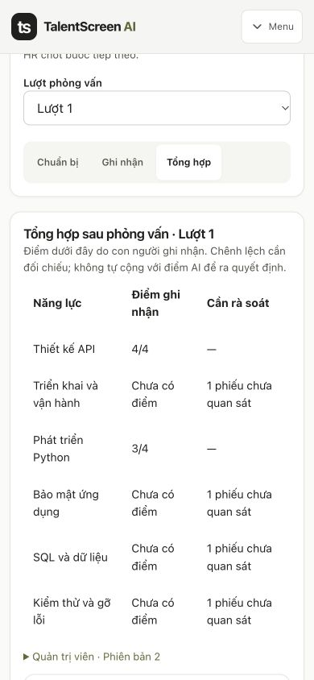
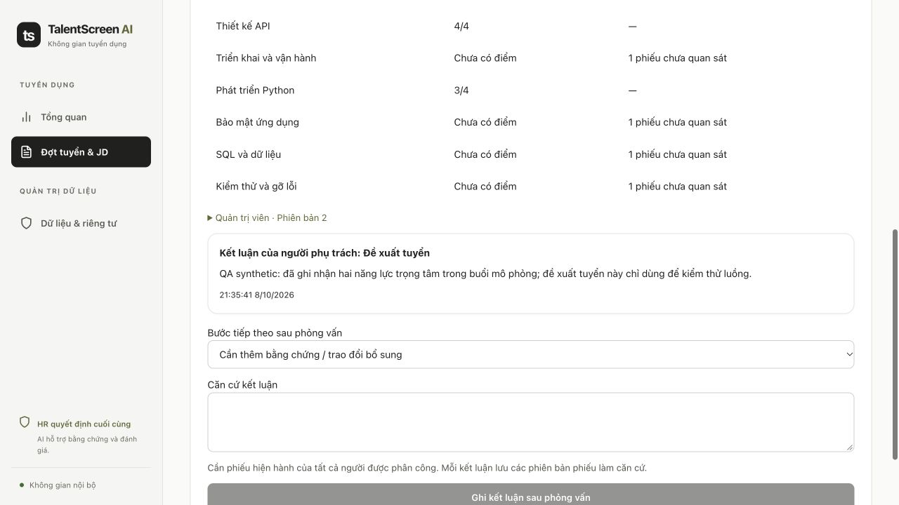

# Workflow B execution ledger
Plan: docs/superpowers/plans/2026-10-08-hr-interview-workflow-b.md
Spec: docs/superpowers/specs/2026-10-08-hr-interview-workflow-b.md

- Ruling: implement inline in the user-requested single main checkout, preserving existing live services; earlier authorization requests one improved main version. Cost if wrong: reversible working-tree edits.
- Ruling: option B is authorized by “oke làm đi B”; continue without another design/plan approval question.
- Pre-flight: task 3 consumes task 1 atomic screening/progress and task 2 round/card/conclusion contracts; no naming conflicts.
- Baseline: 2a76383, clean tree; previous complete regression 320 backend / 16 web. Fresh full regression required after changes.

- Task 1 implementation: atomic screening + saved private criterion progress + waiting/next-step queues. RED: missing routes/stage mismatches; GREEN: workflow B 9/9 and focused legacy suites.
- Task 2 implementation: versioned round preparation, independent save+submit, scorecard correction history and source-bound human conclusions; invitation schedule and question-source checks. Migration downgrade/upgrade exercised only on disposable DB.
- Task 3 implementation: one screening acknowledgement; preparation / record / summary views; edited question revisions, focus criteria and responsive layout. Node tests 20/20 and first production build passed.
- Additional RED/GREEN checks: purge originally failed on InterviewRevision.draft_id; corrected FK field, deletion order and explicit new-record purge. JD change no longer preserves a previous screening outcome; interview conclusion now drives queue stage.
- Additional RED observed: submitted card incorrectly looked fresh after JD change; old invitation survived interview conclusion. Corrections add JD snapshots, invalidate correspondence and require an unconcluded current round.
- Full regression first pass: three legacy tests expected the old migration head or invitation subject. Updated those assertions to the new additive migration and neutral invitation wording; no business safeguards relaxed.
- Local migration upgraded b8c2d41a9e06 -> 0c84e9d57a62. Browser QA uses a new clearly labeled synthetic application only; no hiring decisions on real CVs.

## Fresh review and fixes
The required fresh reviewer resumed after a temporary account usage-limit interruption. It found no critical issues, seven important issues and no minor issues. All seven entered the single RED/GREEN fix pass:
1. Dirty plan/card editing buffers retain their original write token through refresh; question revision edits also retain their predecessor ID. Explicit reload discards a conflicted plan draft.
2. Prior conclusion card versions authorize next-round invitations; amendments invalidate correspondence.
3. Submitted/amended cards refetch the authorized collection; summary is gated while the collection is unavailable.
4. Assignment and source validation now apply to draft writes too; scorecard writes use Requisition -> Application -> scorecard locks.
5. Queue/progress use the latest applicable human conclusion; a future plan does not clear a request-information or stop outcome.
6. Questions bind to the current effective HR correction or AI run; replaced sources make questions stale and block editing/reuse.
7. Invitation approval validates channel-specific join details and recognized placeholders.
RED evidence: /tmp/talentscreen-workflow-b-review-red.log, review2-red.log, effective-red.log and web-review-red.log.

Review boundaries retained (not claims of production certification): live/provider tests use no real candidate decisions; desktop/mobile QA is performed by the executor; real-provider quality/spend is not measured by mocked regression; calendar delivery/offers remain outside scope; no claim of exhaustive race or automated PII detection coverage. Cost if these limits are ignored: unmeasured deployment or hiring risk.

## Final verification

- `PRIVATE_STORAGE_ROOT=/tmp/talentscreen-workflow-b-release PYTEST_ADDOPTS='-rA' make test` exited 0 on the final implementation, after the mobile header/input adjustments. Full output stays in `/tmp/talentscreen-workflow-b-release.log`; it is not published.
- Backend: **338 passed, 0 failed** on disposable PostgreSQL/pgvector, including migration upgrade/downgrade and deletion coverage.
- Frontend: **22 passed, 0 failed**; Next.js production build compiled successfully and generated all 8 routes.
- Provider path: mock; no live model-quality or real hiring-decision claim. No secrets or real candidate content are included in this change.

### Browser QA

Used a new **QA — Workflow B (synthetic)** requisition and application only. Verified admin login, persisted six-criterion review, request-information queue status, superseding screening to invite, a two-focus/one-interviewer round, independent save-and-submit, question revision, and advisory `propose_hire` conclusion. Outside-focus observations remained null.

In two windows, A edited scorecard v1 while B saved v2. A refreshed without losing its local score, then received `SCORECARD_VERSION_CONFLICT` when saving v1. After cancel/reload, the authorized summary showed B’s v2 observations. This proves the tested conflict path rejects overwrites.

The datetime field needed a native keyboard edit after the browser automation’s fill operation; after saving **22/10/2026 10:00** device-local time and reloading, that exact value persisted. An earlier QA plan had no time saved; this was not a date-conversion bug.

Checked **390×844, 820×1180 and 1440×900** layouts; document scroll width matched viewport width at all three. The mobile round selector and question button now stack, and preparation inputs use the shared form styling. Tables/navigation may scroll within their own containers. Temporary viewport overrides were reset.

### Integration rulings

Used the main checkout and the standing user authorization to commit/push one improved version to `main`; no unrelated branches/worktrees were removed. No review findings remain deferred. Real-provider quality and deployment readiness retain the boundaries listed above.
