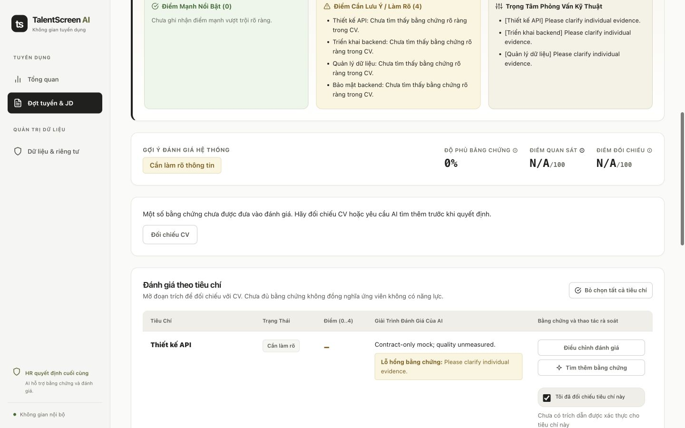

# Jev evidence reranking verification — 9 October 2026

## Scope

Reviewed implementation includes frozen opt-in policy, bounded pair classification/selection, provider-aware atomic admission, private resumable journal, additive migration, initial and agent-tool retrieval integration, explicit synthetic benchmark extension, and the minimal HR evidence-review notice. The five LangGraph nodes and HR decision ownership are unchanged.

## Verification

- Disposable PostgreSQL/pgvector regression; no application's database used. Current full suite: **498 passed, 1 opt-in real-E5 test skipped**, zero errors/failures. Cached real E5 was actually used in separate synthetic live experiments. Existing Starlette 413 deprecation warning remains.
- Frontend: 23 workflow/helper tests passed; Next.js production build compiled and typechecked all eight routes.
- Migration: populated legacy row survives downgrade/upgrade; new journal null for historical rows; deletion purges the run/journal.
- Admission/privacy: last-slot race, provider ceilings, held ambiguous usage, crash without journal, async rollback, resumed ordinal, transport drift, revoked scope, historical hash and authorized-only summary checks passed.
- Actual scripted graph integration exercised two multi-criterion retrieval tools and one repair inside ≤4 primary / ≤9 Jev / ≤13 total ceilings.
- Browser QA: disposable synthetic login → assessment → notice → approved redacted CV → mark all five criteria reviewed → HR request-information conclusion persisted. No console errors observed. At 390×844, 820×1180, and 1440×900, document width matched viewport; no horizontal overflow.

The omission count in browser QA was injected into a disposable synthetic journal to exercise the notice. It is not a model-quality measurement. The screenshot contains synthetic records only.

## Live experiment and limitations

Jev actually served `typesafe/jev-1.13-20260917`; direct DeepSeek also ran. 21/22 assessment runs accepted plus one successful paid probe. Negative-group losses and one unknown provider outcome prevent activation. Off/enabled query comparison was confounded before the post-run fix, now covered by new regression tests. No paid retries after unresolved spend. See [full results](../evaluation/jev-reranking-results-2026-10-09.md).

Default remains off, gate remains internal synthetic-only, no deployment or running application database migration was performed. Real hiring accuracy, fairness, independent holdout, conflicting-evidence retention and production SLOs are not established.
